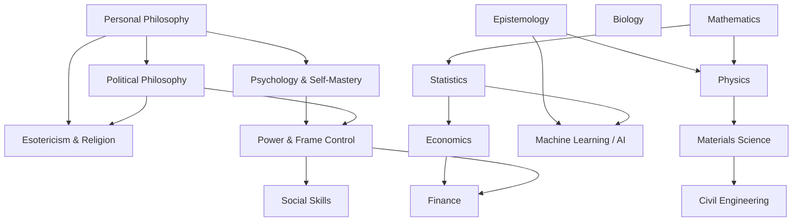

# Skill Trees

A personal map of the things I want to learn, organized as skill trees. Each
tree is a folder: an `index.md` with a Mermaid flowchart overview, plus one
article file per section going into actual depth on that section's topics.

## Trees

**Philosophy & Mind**
- [Personal Philosophy](trees/personal-philosophy/index.md)
- [Political Philosophy](trees/political-philosophy/index.md)
- [Epistemology](trees/epistemology/index.md)
- [Esotericism & Religion](trees/esotericism-and-religion/index.md)
- [Psychology & Self-Mastery](trees/psychology-self-mastery/index.md)

**Power & Social**
- [Power & Frame Control](trees/power-and-frame-control/index.md)
- [Social Skills](trees/social-skills/index.md)

**Hard Sciences**
- [Physics](trees/physics/index.md)
- [Biology](trees/biology/index.md)
- [Mathematics](trees/math/index.md)
- [Statistics](trees/statistics/index.md)
- [Materials Science](trees/materials-science/index.md)

**Applied / Quant**
- [Machine Learning / AI](trees/machine-learning-ai/index.md)
- [Civil Engineering](trees/civil-engineering/index.md)
- [Economics](trees/economics/index.md)
- [Finance](trees/finance/index.md)

**Reading**
- [Book List](BOOKLIST.md) — every book/resource read across all trees,
  cross-referenced back to the section that cites it. Empty until entries
  get added.

## How the trees relate

The domains overlap a lot, so nodes in one tree sometimes point at a related
node in another — each tree's index file has the specific pointers in its
"Related Trees" section.

## Structure

Each tree lives at `trees/<name>/`:

- **`index.md`** — intro blurb, the Mermaid flowchart (structure/order —
  unchanged from before), a "Sections" list linking to that tree's article
  files, a link to the Book List, and "Related Trees."
- **One article file per section** (a section = one `subgraph` block in the
  diagram) — real depth on each topic in that section, not just a table
  row. For most trees this means, per topic: a substantive paragraph of
  actual content (explanation, key debates, open questions worth knowing),
  a status checkbox, and a resources list.

**Personal Philosophy and Political Philosophy are the exception** — their
section files are structured as **open questions** instead of topic
explanations: the question itself, a `**My answer:**` placeholder to fill
in over time, and separate `**Resources read:**` / `**Resources to read:**`
lists. The point of those two trees isn't to "learn" a fixed body of
material, it's to work out and record an actual position — so the file
format reflects that.

## Conventions

- **Node IDs are prefixed** per tree (`PP_`, `EP_`, `POL_`, ...) so IDs never
  collide if trees are ever merged into one diagram, and article headers
  reference the ID (e.g. `## Rational Egoism (\`PP_EGO\`)`) so it's easy to
  find a node's full write-up from the diagram.
- **Diagrams are vertical.** Use `flowchart TD` and chain nodes top-to-bottom
  in narrow columns rather than fanning siblings out side by side. Where
  topics are really alternatives rather than a strict prerequisite chain,
  they're still drawn as a top-to-bottom sequence — the arrow means "comes
  next in a sensible reading order," not always "strictly requires." Keep
  any unavoidable branching to 2–3 nodes wide at most.
- **No capstones.** Trees end at their most advanced listed topic — don't
  add a synthetic "capstone project" node that wasn't asked for.
- **Cross-tree links are plain markdown links**, not Mermaid `click` events —
  GitHub's Mermaid renderer doesn't reliably support in-diagram links, so
  navigation between trees lives in the "Related Trees" section and, for a
  tree that's really a deep dive off of a node in another tree, a dashed
  cross-link node in the diagram itself.
- **Status values**: `[ ]` not started, `[~]` in progress, `[x]` done.
- **Contested topics get a steelman first.** Political Philosophy in
  particular is meant to sharpen positions well enough to counter them — the
  resource notes there should point at the strongest form of the opposing
  view before the counter-case is built. A counter to a strawman isn't
  worth having.
- **The Book List is the single place all reading gets logged.** A
  section's resource list can just point back at it ("see Book List")
  instead of repeating a full citation once a book's actually been read.

## Adding a new tree

1. Create `trees/<name>/index.md` and one article file per planned section.
2. Follow the shape of an existing tree of the same kind — a topical tree
   like [Physics](trees/physics/index.md) for most subjects, or the
   open-question shape of [Personal Philosophy](trees/personal-philosophy/index.md)
   if the tree is really about working out a position rather than learning
   fixed material.
3. Add it to the list above and, if it meaningfully overlaps with an
   existing tree, add a link in both directions.
4. Add a heading for it in [BOOKLIST.md](BOOKLIST.md).
