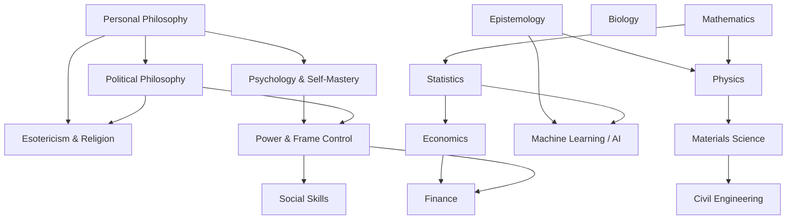

# Skill Trees

A personal map of the things I want to learn, organized as skill trees. Each
tree is a Mermaid flowchart showing how concepts build on each other, plus a
tracking table so I can mark progress and jot down resources.

## Trees

**Philosophy & Mind**
- [Personal Philosophy](trees/personal-philosophy.md)
- [Political Philosophy](trees/political-philosophy.md)
- [Epistemology](trees/epistemology.md)
- [Esotericism & Religion](trees/esotericism-and-religion.md)
- [Psychology & Self-Mastery](trees/psychology-self-mastery.md)

**Power & Social**
- [Power & Frame Control](trees/power-and-frame-control.md)
- [Social Skills](trees/social-skills.md)

**Hard Sciences**
- [Physics](trees/physics.md)
- [Biology](trees/biology.md)
- [Mathematics](trees/math.md)
- [Statistics](trees/statistics.md)
- [Materials Science](trees/materials-science.md)

**Applied / Quant**
- [Machine Learning / AI](trees/machine-learning-ai.md)
- [Civil Engineering](trees/civil-engineering.md)
- [Economics](trees/economics.md)
- [Finance](trees/finance.md)

## How the trees relate

The domains overlap a lot, so nodes in one tree sometimes point at a related
node in another — each tree's file has the specific pointers in its
"Related Trees" section.

## Conventions

These keep the trees consistent as more get added:

- **One file per tree**, under `trees/`, named `kebab-case.md`.
- **Node IDs are prefixed** per tree (`PP_`, `EP_`, `POL_`, ...) so IDs never
  collide if trees are ever merged into one diagram.
- **Diagrams are vertical.** Use `flowchart TD` and chain nodes top-to-bottom
  in narrow columns rather than fanning siblings out side by side. Where
  topics are really alternatives rather than a strict prerequisite chain
  (e.g. competing theories, parallel branches of a field), they're still
  drawn as a top-to-bottom sequence — the arrow means "comes next in a
  sensible reading order," not always "strictly requires." Keep any
  unavoidable branching to 2–3 nodes wide at most, so the diagram reads as a
  column, not a sprawl.
- **No capstones.** Trees end at their most advanced listed topic — don't
  add a synthetic "capstone project" node that wasn't asked for.
- **Diagram = structure, table = state.** The Mermaid flowchart shows
  dependencies/order; the table below it is what actually gets edited day to
  day — status checkbox and resources.
- **Cross-tree links are plain markdown links**, not Mermaid `click` events —
  GitHub's Mermaid renderer doesn't reliably support in-diagram links, so
  navigation between trees lives in the "Related Trees" section and, for a
  tree that's really a deep dive off of a node in another tree (e.g.
  Political Philosophy off of Personal Philosophy), a dashed cross-link node
  in the diagram itself.
- **Status values**: `[ ]` not started, `[~]` in progress, `[x]` done.
- **Contested topics get a steelman first.** For trees that cover positions
  meant to be argued (see Political Philosophy), the resource notes should
  point at the strongest form of the opposing view before the counter-case —
  a counter to a strawman isn't worth having.

## Adding a new tree

1. Create `trees/<name>.md`.
2. Follow the shape of an existing tree: intro blurb, a vertical Mermaid
   `flowchart TD` with subgraphs for phases, a node table, and a "Related
   Trees" section.
3. Add it to the list above and, if it meaningfully overlaps with an
   existing tree, add a link in both directions.
