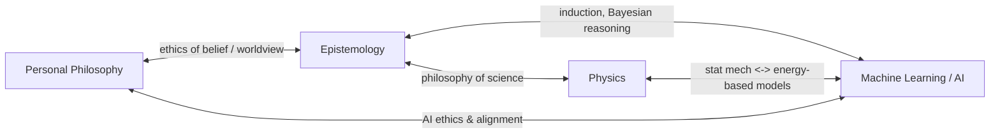

# Skill Trees

A personal map of the things I want to learn, organized as skill trees. Each
tree is a Mermaid flowchart showing how concepts build on each other, plus a
tracking table so I can mark progress and jot down resources.

## Trees

- [Personal Philosophy](trees/personal-philosophy.md)
- [Epistemology](trees/epistemology.md)
- [Physics](trees/physics.md)
- [Machine Learning / AI](trees/machine-learning-ai.md)

## How the trees relate

The domains overlap a lot, so nodes in one tree sometimes point at a related
node in another. This is just a rough sketch of the biggest cross-links —
each tree's own file has the specific pointers.

## Conventions

These keep the trees consistent as more get added:

- **One file per tree**, under `trees/`, named `kebab-case.md`.
- **Node IDs are prefixed** per tree (`PP_`, `EP_`, `PH_`, `ML_`, ...) so IDs
  never collide if trees are ever merged into one diagram.
- **Diagram = structure, table = state.** The Mermaid flowchart shows
  dependencies (what to learn before what); the table below it is what
  actually gets edited day to day — status checkbox and resources.
- **Cross-tree links are plain markdown links**, not Mermaid `click` events —
  GitHub's Mermaid renderer doesn't reliably support in-diagram links, so
  navigation between trees lives in the "Related Trees" section and the
  table's notes column instead.
- **Status values**: `[ ]` not started, `[~]` in progress, `[x]` done.

## Adding a new tree

1. Create `trees/<name>.md`.
2. Follow the shape of an existing tree: intro blurb, Mermaid `flowchart TD`
   with subgraphs for phases (Foundations → Core → Advanced → Capstone),
   a node table, and a "Related Trees" section.
3. Add it to the list above and, if it meaningfully overlaps with an
   existing tree, add a link in both directions.
