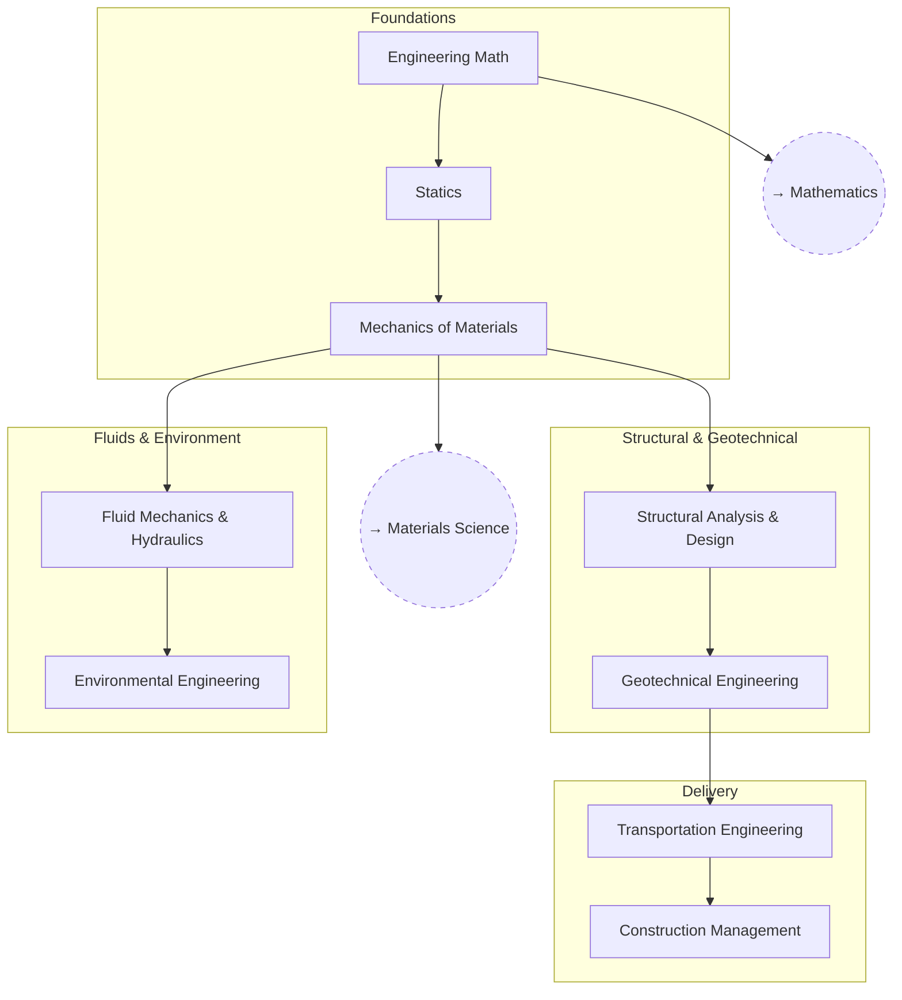

# Civil Engineering

From statics and mechanics of materials up through structural design and
the built environment.

The structure below follows the discipline's own progression: a shared
analytical foundation, then the four sub-disciplines that branch off it,
ending in how a design actually gets built.

## Tree

## Related Trees

- [Mathematics](../math/index.md) — `CE_MATH` draws on `MATH_DIFFEQ`.
- [Materials Science](../materials-science/index.md) — `CE_MECH` is the
  applied counterpart to `MAT_MECH`.
- [Physics](../physics/index.md) — `CE_STATICS` builds on `PH_CLASS`.

See also: [Book List](../../BOOKLIST.md).
