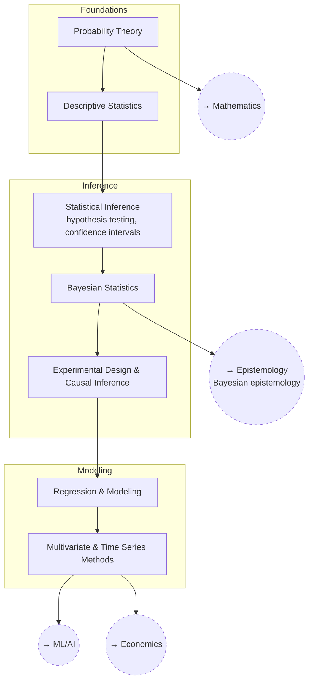

# Statistics

Probability, inference, and how to actually trust (or distrust) a
conclusion drawn from data.

The structure below runs from what probability *is*, through the two rival
inferential frameworks, to the modelling methods built on top of them.

## Tree

## Related Trees

- [Mathematics](../math/index.md) — `STAT_PROB` builds on `MATH_LINALG` and
  `MATH_REALANAL`.
- [Epistemology](../../self/epistemology/index.md) — `STAT_BAYES` is `EP_BAYES` in
  practice.
- [Machine Learning / AI](../machine-learning-ai/index.md) — `STAT_MULTI` feeds
  `ML_MATH` and `ML_EVAL`.
- [Economics](../economics/index.md) — `STAT_MULTI` underlies `ECON_MACRO`
  modeling.
- [Biology](../biology/index.md) — `STAT_EXPDESIGN` underlies `BIO_EVO`
  (population genetics) and experimental biology generally.

See also: [Book List](../../BOOKLIST.md).
