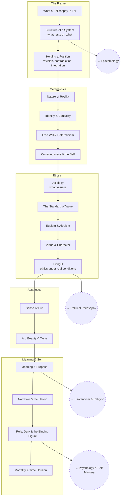

# Personal Philosophy

Constructing a philosophy from the ground up, on the classical branches.
Articles are questions to work through, not write-ups.

## Tree

## Articles

**The Frame**
- [What a Philosophy Is For](articles/what-a-philosophy-is-for.md) — `PP_WHATFOR`
- [Structure of a System](articles/structure-of-a-system.md) — `PP_STRUCTURE`
- [Holding a Position](articles/holding-a-position.md) — `PP_METHOD`

**Metaphysics**
- [Nature of Reality](articles/nature-of-reality.md) — `PP_REALITY`
- [Identity & Causality](articles/identity-and-causality.md) — `PP_IDENTITY`
- [Free Will & Determinism](articles/free-will-and-determinism.md) — `PP_FREEWILL`
- [Consciousness & the Self](articles/consciousness-and-the-self.md) — `PP_MIND`

**Ethics**
- [Axiology — What Value Is](articles/axiology.md) — `PP_AXIOLOGY`
- [The Standard of Value](articles/the-standard-of-value.md) — `PP_STANDARD`
- [Egoism & Altruism](articles/egoism-and-altruism.md) — `PP_EGOISM`
- [Virtue & Character](articles/virtue-and-character.md) — `PP_VIRTUE`
- [Living It](articles/living-it.md) — `PP_PRACTICE`

**Aesthetics**
- [Sense of Life](articles/sense-of-life.md) — `PP_SENSE`
- [Art, Beauty & Taste](articles/art-beauty-and-taste.md) — `PP_ART`

**Meaning & Self**
- [Meaning & Purpose](articles/meaning-and-purpose.md) — `PP_MEANING`
- [Narrative & the Heroic](articles/narrative-and-the-heroic.md) — `PP_NARRATIVE`
- [Role, Duty & the Binding Figure](articles/role-duty-and-the-binding-figure.md) — `PP_ROLE`
- [Mortality & Time Horizon](articles/mortality-and-time-horizon.md) — `PP_MORTALITY`

## Related Trees

- [Epistemology](../epistemology/index.md) — the branch this system's
  claims to knowledge have to answer to.
- [Political Philosophy](../political-philosophy/index.md) — where the
  ethics gets extended to how people live together.
- [Psychology & Self-Mastery](../psychology-self-mastery/index.md) — the
  mechanics of actually running on a philosophy.
- [Esotericism & Religion](../esotericism-and-religion/index.md) — what the
  religious traditions are doing that a secular system has to account for.

See also: [Book List](../../BOOKLIST.md).
