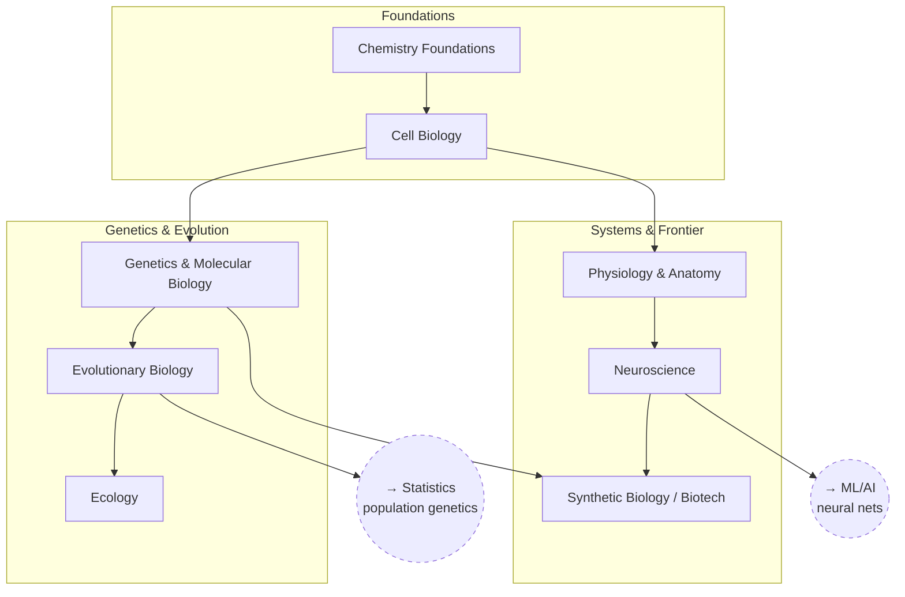

# Biology

From chemistry up through cells, genetics, and systems, to the
neuroscience/biotech frontier.

## Skill Tree

## Nodes

| ID | Concept | Depends on | Status | Resources / Notes |
|---|---|---|---|---|
| BIO_CHEM | Chemistry Foundations | — | [ ] | |
| BIO_CELL | Cell Biology | BIO_CHEM | [ ] | |
| BIO_GENETICS | Genetics & Molecular Biology | BIO_CELL | [ ] | |
| BIO_EVO | Evolutionary Biology | BIO_GENETICS | [ ] | |
| BIO_ECO | Ecology | BIO_EVO | [ ] | |
| BIO_PHYS | Physiology & Anatomy | BIO_CELL | [ ] | |
| BIO_NEURO | Neuroscience | BIO_PHYS | [ ] | |
| BIO_SYNBIO | Synthetic Biology / Biotech | BIO_NEURO, BIO_GENETICS | [ ] | |

## Related Trees

- [Statistics](statistics.md) — `BIO_EVO` (population genetics) leans on
  `STAT_EXPDESIGN`.
- [Machine Learning / AI](machine-learning-ai.md) — `BIO_NEURO` is the
  biological inspiration for `ML_NN`.
- [Materials Science](materials-science.md) — `BIO_CHEM` overlaps with
  `MAT_CHEM`.
