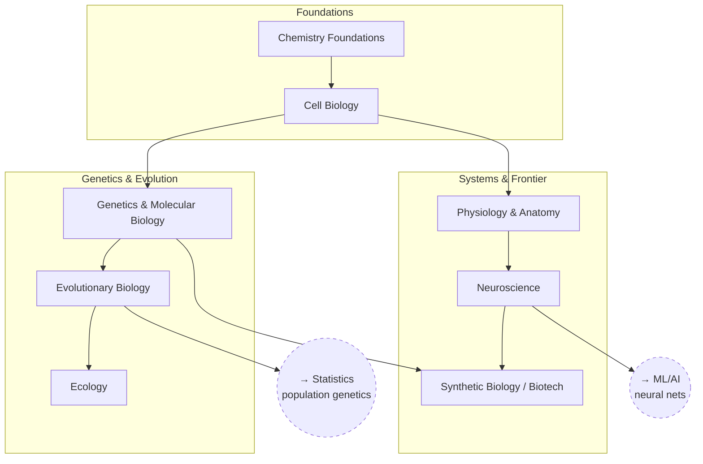

# Biology

From chemistry up through cells, genetics, and systems, to the
neuroscience/biotech frontier.

## Skill Tree

## Sections

- [Foundations](./foundations.md) — `BIO_CHEM` `BIO_CELL`
- [Genetics & Evolution](./genetics-and-evolution.md) — `BIO_GENETICS` `BIO_EVO` `BIO_ECO`
- [Systems & Frontier](./systems-and-frontier.md) — `BIO_PHYS` `BIO_NEURO` `BIO_SYNBIO`

See also: [Book List](../../BOOKLIST.md).

## Related Trees

- [Statistics](../statistics/index.md) — `BIO_EVO` (population genetics) leans on
  `STAT_EXPDESIGN`.
- [Machine Learning / AI](../machine-learning-ai/index.md) — `BIO_NEURO` is the
  biological inspiration for `ML_NN`.
- [Materials Science](../materials-science/index.md) — `BIO_CHEM` overlaps
  with `MAT_CHEM`.
