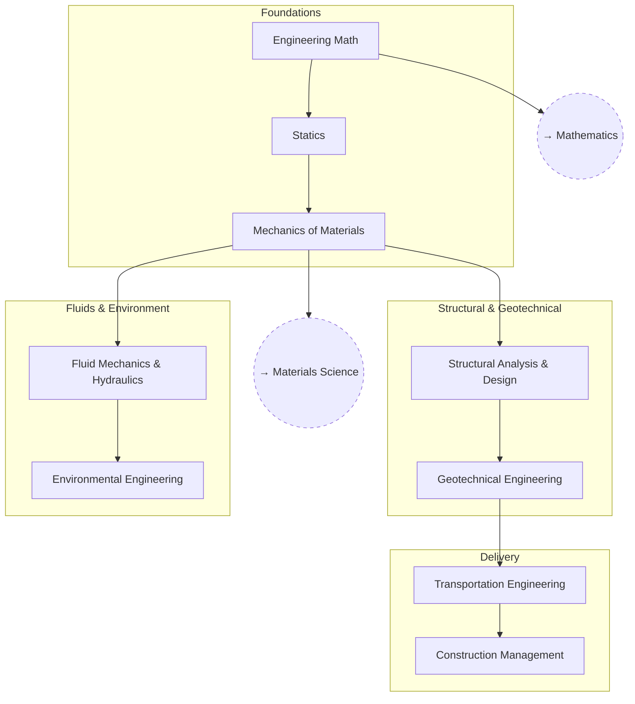

# Civil Engineering

From statics and mechanics of materials up through structural design and
the built environment.

## Skill Tree

## Nodes

| ID | Concept | Depends on | Status | Resources / Notes |
|---|---|---|---|---|
| CE_MATH | Engineering Math | — | [ ] | |
| CE_STATICS | Statics | CE_MATH | [ ] | |
| CE_MECH | Mechanics of Materials | CE_STATICS | [ ] | |
| CE_STRUCT | Structural Analysis & Design | CE_MECH | [ ] | |
| CE_GEOTECH | Geotechnical Engineering | CE_STRUCT | [ ] | |
| CE_FLUID | Fluid Mechanics & Hydraulics | CE_MECH | [ ] | |
| CE_ENV | Environmental Engineering | CE_FLUID | [ ] | |
| CE_TRANSPORT | Transportation Engineering | CE_GEOTECH | [ ] | |
| CE_CONST | Construction Management | CE_TRANSPORT | [ ] | |

## Related Trees

- [Mathematics](math.md) — `CE_MATH` draws on `MATH_DIFFEQ`.
- [Materials Science](materials-science.md) — `CE_MECH` is the applied
  counterpart to `MAT_MECH`.
- [Physics](physics.md) — `CE_STATICS` builds on `PH_CLASS`.
