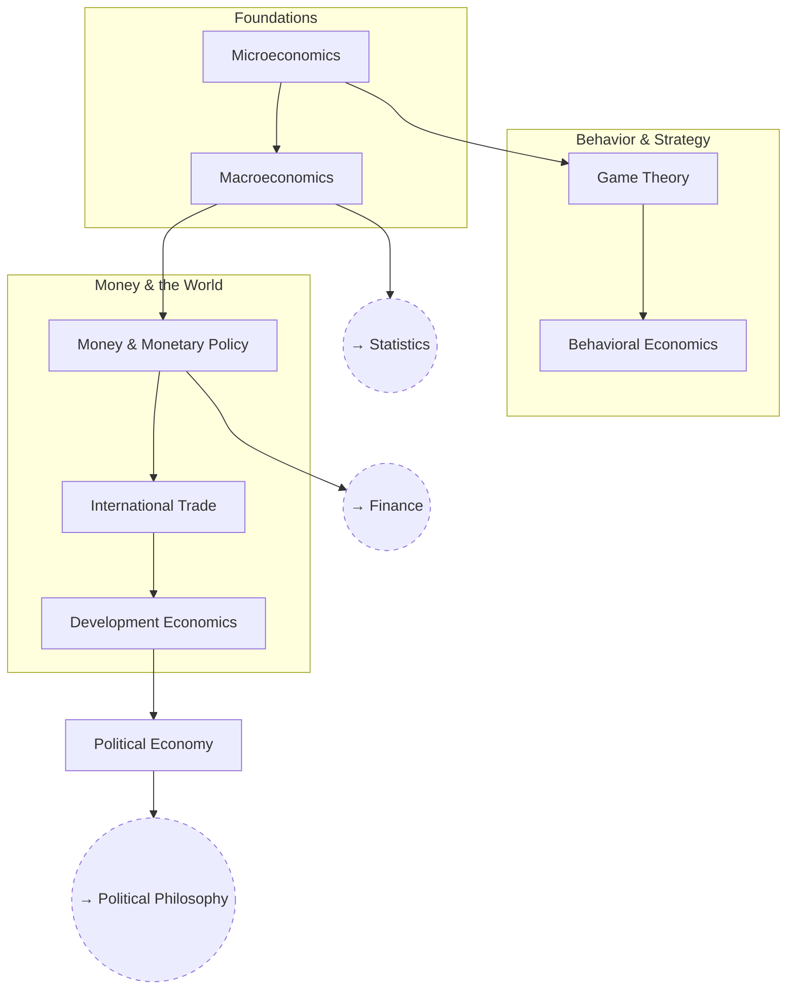

# Economics

Micro and macro fundamentals up through game theory, money, and political
economy.

## Skill Tree

## Nodes

| ID | Concept | Depends on | Status | Resources / Notes |
|---|---|---|---|---|
| ECON_MICRO | Microeconomics | — | [ ] | |
| ECON_MACRO | Macroeconomics | ECON_MICRO | [ ] | |
| ECON_GAME | Game Theory | ECON_MICRO | [ ] | |
| ECON_BEHAV | Behavioral Economics | ECON_GAME | [ ] | |
| ECON_MONEY | Money & Monetary Policy | ECON_MACRO | [ ] | |
| ECON_TRADE | International Trade | ECON_MONEY | [ ] | |
| ECON_DEV | Development Economics | ECON_TRADE | [ ] | |
| ECON_POLECON | Political Economy | ECON_DEV | [ ] | |

## Related Trees

- [Statistics](statistics.md) — `ECON_MACRO` modeling leans on
  `STAT_MULTI`.
- [Finance](finance.md) — `ECON_MONEY` underlies `FIN_MARKETS`.
- [Political Philosophy](political-philosophy.md) — `ECON_POLECON` connects
  to `POL_FACTIONS`.
