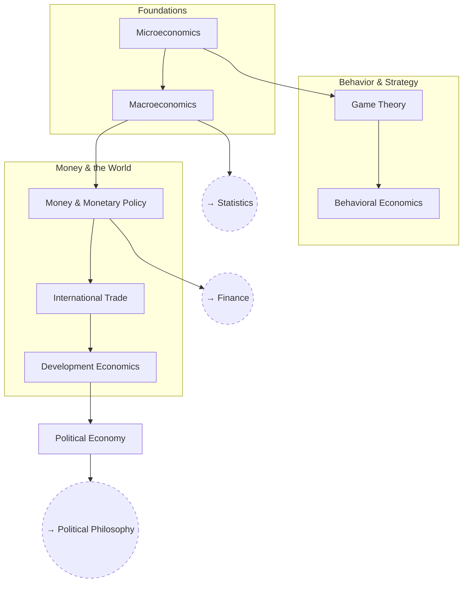

# Economics

How choice, coordination, and money actually work — and how much of what
the field claims to know is settled versus contested. The structure below
is the conventional construction of the subject: individual choice, then
strategic interaction, then aggregates and money, then the politics that
economic analysis usually assumes away.

Specific positions and current arguments live as open questions inside
the branch they belong to, not as branches of their own.

## Tree

## Related Trees

- [Statistics](../statistics/index.md) — the inference machinery every
  empirical claim in this tree depends on.
- [Finance](../finance/index.md) — where money and asset prices get
  treated as a subject in their own right.
- [Political Philosophy](../political-philosophy/index.md) — the
  questions about property and distribution that economics inherits
  rather than answers.

See also: [Book List](../../BOOKLIST.md).
