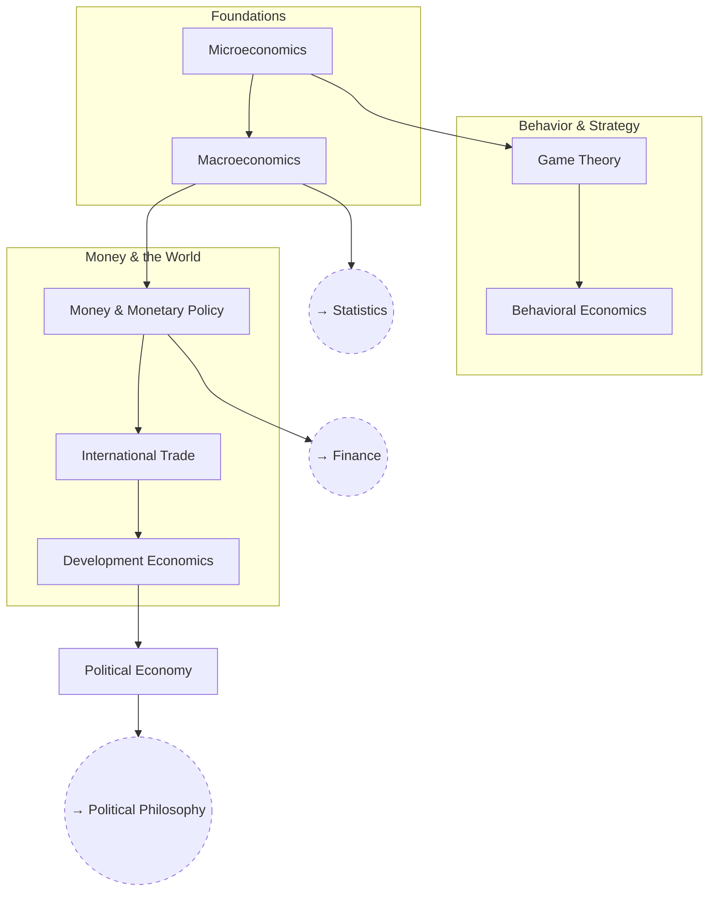

# Economics

Micro and macro fundamentals up through game theory, money, and political
economy.

## Skill Tree

## Sections

- [Foundations](./foundations.md) — `ECON_MICRO` `ECON_MACRO`
- [Behavior & Strategy](./behavior-and-strategy.md) — `ECON_GAME` `ECON_BEHAV`
- [Money & the World](./money-and-the-world.md) — `ECON_MONEY` `ECON_TRADE` `ECON_DEV` `ECON_POLECON`

See also: [Book List](../../BOOKLIST.md).

## Related Trees

- [Statistics](../statistics/index.md) — `ECON_MACRO` modeling leans on
  `STAT_MULTI`.
- [Finance](../finance/index.md) — `ECON_MONEY` underlies `FIN_MARKETS`.
- [Political Philosophy](../political-philosophy/index.md) — `ECON_POLECON`
  connects to `POL_FACTIONS`.
