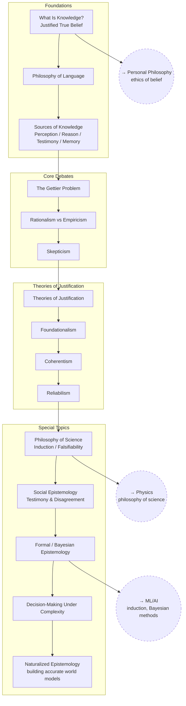

# Epistemology

The theory of knowledge: what knowledge is, where it comes from, when belief
is justified, and how confident we should be in anything.

## Skill Tree

## Nodes

| ID | Concept | Depends on | Status | Resources / Notes |
|---|---|---|---|---|
| EP_INTRO | What Is Knowledge? (JTB) | — | [ ] | |
| EP_LANG | Philosophy of Language | EP_INTRO | [ ] | |
| EP_SOURCES | Sources of Knowledge | EP_LANG | [ ] | |
| EP_GETTIER | The Gettier Problem | EP_SOURCES | [ ] | |
| EP_RATEMP | Rationalism vs Empiricism | EP_GETTIER | [ ] | |
| EP_SKEPT | Skepticism | EP_RATEMP | [ ] | |
| EP_JUST | Theories of Justification | EP_SKEPT | [ ] | |
| EP_FOUND | Foundationalism | EP_JUST | [ ] | |
| EP_COH | Coherentism | EP_FOUND | [ ] | |
| EP_REL | Reliabilism | EP_COH | [ ] | |
| EP_SCI | Philosophy of Science (induction, falsifiability) | EP_REL | [ ] | |
| EP_SOCIAL | Social Epistemology (testimony, disagreement) | EP_SCI | [ ] | |
| EP_BAYES | Formal / Bayesian Epistemology | EP_SOCIAL | [ ] | |
| EP_COMPLEX | Decision-Making Under Complexity | EP_BAYES | [ ] | |
| EP_NAT | Naturalized Epistemology (building accurate world models) | EP_COMPLEX | [ ] | |

## Related Trees

- [Personal Philosophy](personal-philosophy.md) — `EP_INTRO` underlies the
  whole worldview-building project.
- [Physics](physics.md) — `EP_SCI` (induction/falsifiability) is the
  philosophical backbone of `PH_PHILO` (interpretations of QM).
- [Machine Learning / AI](machine-learning-ai.md) — `EP_BAYES` maps directly
  onto `ML_EVAL`; the induction problem in `EP_SCI` is exactly the
  generalization problem in ML.
