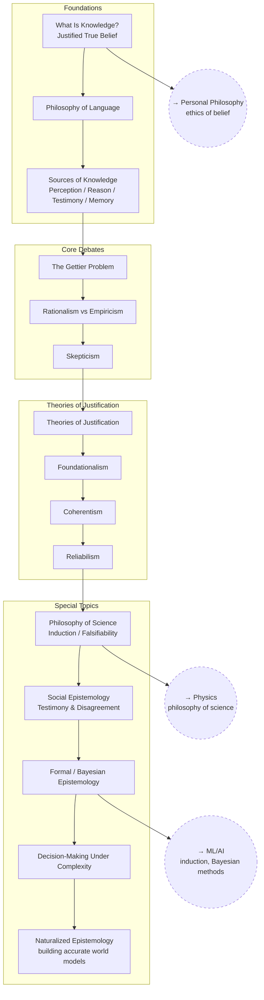

# Epistemology

The theory of knowledge: what knowledge is, where it comes from, when
belief is justified, and how much confidence anything deserves.

The structure below runs from the analysis of knowledge, through the
debates that break it, to the theories built to repair it and the places
where the whole question gets applied — science, other people, and
decisions made under uncertainty.

## Tree

## Articles

**Foundations**
- [What Is Knowledge?](articles/what-is-knowledge.md) — `EP_INTRO`
- [Philosophy of Language](articles/philosophy-of-language.md) — `EP_LANG`
- [Sources of Knowledge](articles/sources-of-knowledge.md) — `EP_SOURCES`

**Core Debates**
- [The Gettier Problem](articles/the-gettier-problem.md) — `EP_GETTIER`
- [Rationalism vs Empiricism](articles/rationalism-vs-empiricism.md) — `EP_RATEMP`
- [Skepticism](articles/skepticism.md) — `EP_SKEPT`

**Theories of Justification**
- [Theories of Justification](articles/theories-of-justification.md) — `EP_JUST`
- [Foundationalism](articles/foundationalism.md) — `EP_FOUND`
- [Coherentism](articles/coherentism.md) — `EP_COH`
- [Reliabilism](articles/reliabilism.md) — `EP_REL`

**Special Topics**
- [Philosophy of Science](articles/philosophy-of-science.md) — `EP_SCI`
- [Social Epistemology](articles/social-epistemology.md) — `EP_SOCIAL`
- [Formal / Bayesian Epistemology](articles/formal-bayesian-epistemology.md) — `EP_BAYES`
- [Decision-Making Under Complexity](articles/decision-making-under-complexity.md) — `EP_COMPLEX`
- [Naturalized Epistemology](articles/naturalized-epistemology.md) — `EP_NAT`

## Related Trees

- [Personal Philosophy](../personal-philosophy/index.md) — `EP_INTRO`
  underlies the whole worldview-building project.
- [Physics](../physics/index.md) — `EP_SCI` (induction/falsifiability) is the
  philosophical backbone of `PH_PHILO` (interpretations of QM).
- [Machine Learning / AI](../machine-learning-ai/index.md) — `EP_BAYES` maps
  directly onto `ML_EVAL`; the induction problem in `EP_SCI` is exactly the
  generalization problem in ML.

See also: [Book List](../../BOOKLIST.md).
