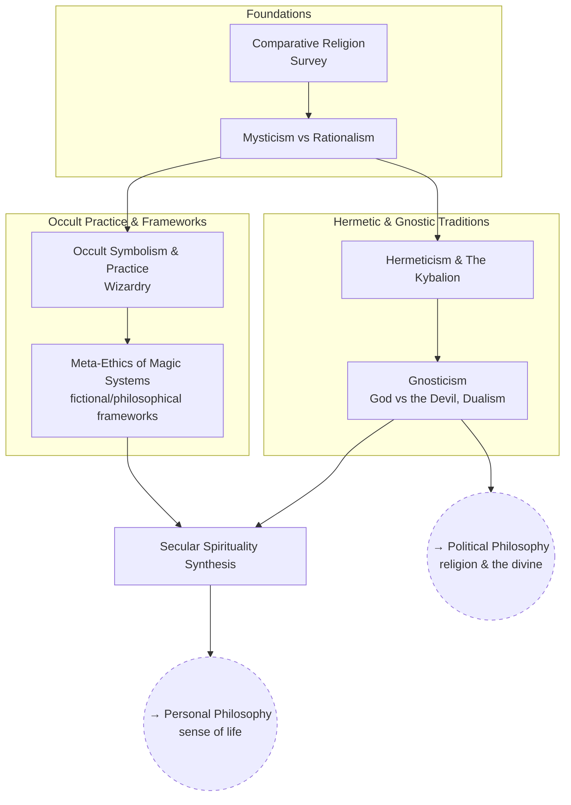

# Esotericism & Religion

Comparative religion, occult/hermetic traditions, and how to fold what's
useful in them into a rational, secular worldview.

## Skill Tree

## Nodes

| ID | Concept | Depends on | Status | Resources / Notes |
|---|---|---|---|---|
| ES_COMPREL | Comparative Religion (survey) | — | [ ] | |
| ES_MYSTIC | Mysticism vs Rationalism | ES_COMPREL | [ ] | |
| ES_HERMET | Hermeticism & The Kybalion | ES_MYSTIC | [ ] | *The Kybalion* (1908); *Corpus Hermeticum* |
| ES_GNOSTIC | Gnosticism — God vs the Devil, Dualism | ES_HERMET | [ ] | |
| ES_OCCULT | Occult Symbolism & Practice | ES_MYSTIC | [ ] | |
| ES_MAGIC_ETHICS | Meta-Ethics of Magic Systems | ES_OCCULT | [ ] | Comparing fictional magic-system rules as ethics thought experiments |
| ES_SECULAR | Secular Spirituality Synthesis | ES_GNOSTIC, ES_MAGIC_ETHICS | [ ] | Ties back to sense of life / a useful, non-literal concept of the divine |

## Related Trees

- [Personal Philosophy](personal-philosophy.md) — `ES_SECULAR` feeds back
  into `PP_SENSE` (sense of life).
- [Political Philosophy](political-philosophy.md) — `ES_GNOSTIC` connects to
  `POL_DIVINE` and `POL_THEOCRACY`.
