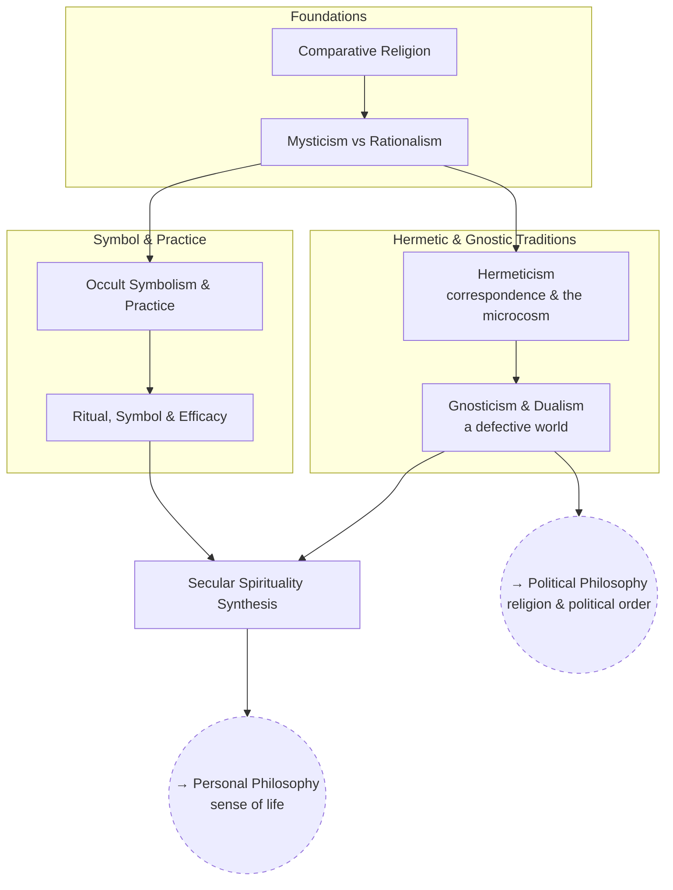

# Esotericism & Religion

What religions and esoteric traditions are actually doing — as claims about
the world, as practices, and as social machinery — and what a secular
worldview has to account for or replace.

The structure is the comparative study of religion: survey first, then the
specific traditions, then the question of practice, then what carries over.
Particular systems and personal enthusiasms are open questions *inside*
these branches, not branches of their own.

## Tree

## Articles

**Foundations**
- [Comparative Religion](articles/comparative-religion.md) — `ES_COMPREL`
- [Mysticism vs Rationalism](articles/mysticism-and-rationalism.md) — `ES_MYSTIC`

**Hermetic & Gnostic Traditions**
- [Hermeticism](articles/hermeticism.md) — `ES_HERMET`
- [Gnosticism & Dualism](articles/gnosticism-and-dualism.md) — `ES_GNOSTIC`

**Symbol & Practice**
- [Occult Symbolism & Practice](articles/occult-symbolism-and-practice.md) — `ES_OCCULT`
- [Ritual, Symbol & Efficacy](articles/ritual-symbol-and-efficacy.md) — `ES_RITUAL`

**Synthesis**
- [Secular Spirituality Synthesis](articles/secular-spirituality.md) — `ES_SECULAR`

## Related Trees

- [Personal Philosophy](../personal-philosophy/index.md) — secular
  spirituality feeds back into sense of life.
- [Political Philosophy](../political-philosophy/index.md) — what religion
  is doing that political order depends on.

See also: [Book List](../../BOOKLIST.md).
