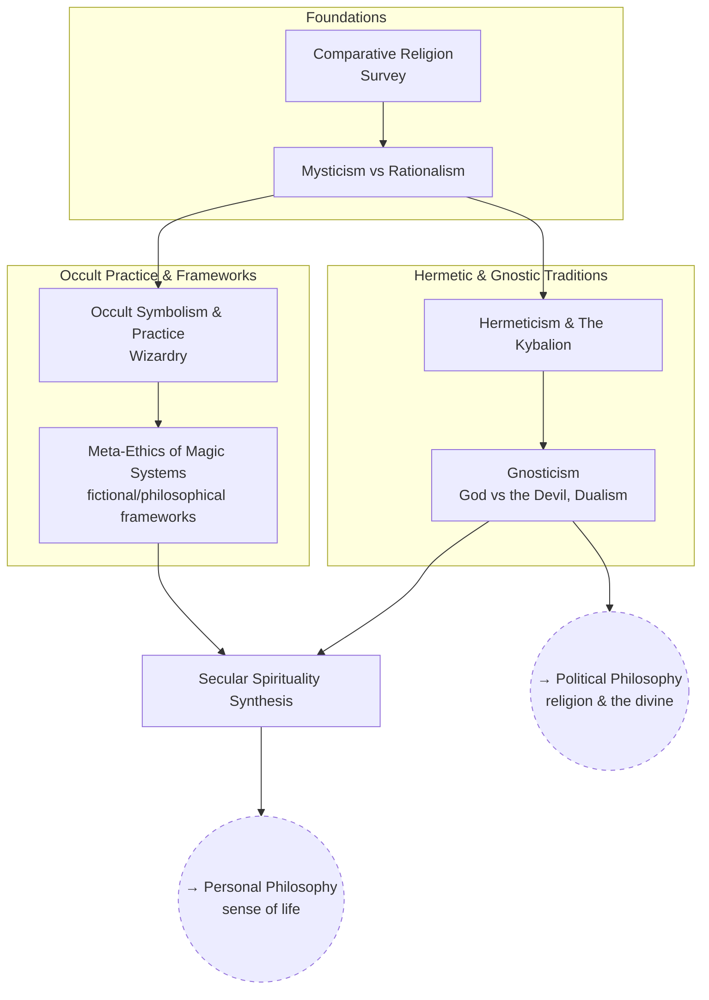

# Esotericism & Religion

Comparative religion, occult/hermetic traditions, and how to fold what's
useful in them into a rational, secular worldview.

## Skill Tree

## Sections

- [Foundations](./foundations.md) — `ES_COMPREL` `ES_MYSTIC`
- [Hermetic & Gnostic Traditions](./hermetic-and-gnostic-traditions.md) — `ES_HERMET` `ES_GNOSTIC`
- [Occult Practice & Frameworks](./occult-practice-and-frameworks.md) — `ES_OCCULT` `ES_MAGIC_ETHICS`
- [Secular Spirituality](./secular-spirituality.md) — `ES_SECULAR`

See also: [Book List](../../BOOKLIST.md).

## Related Trees

- [Personal Philosophy](../personal-philosophy/index.md) — Secular
  Spirituality feeds back into Sense of Life.
- [Political Philosophy](../political-philosophy/index.md) — Gnosticism
  connects to Religion & the Divine.
