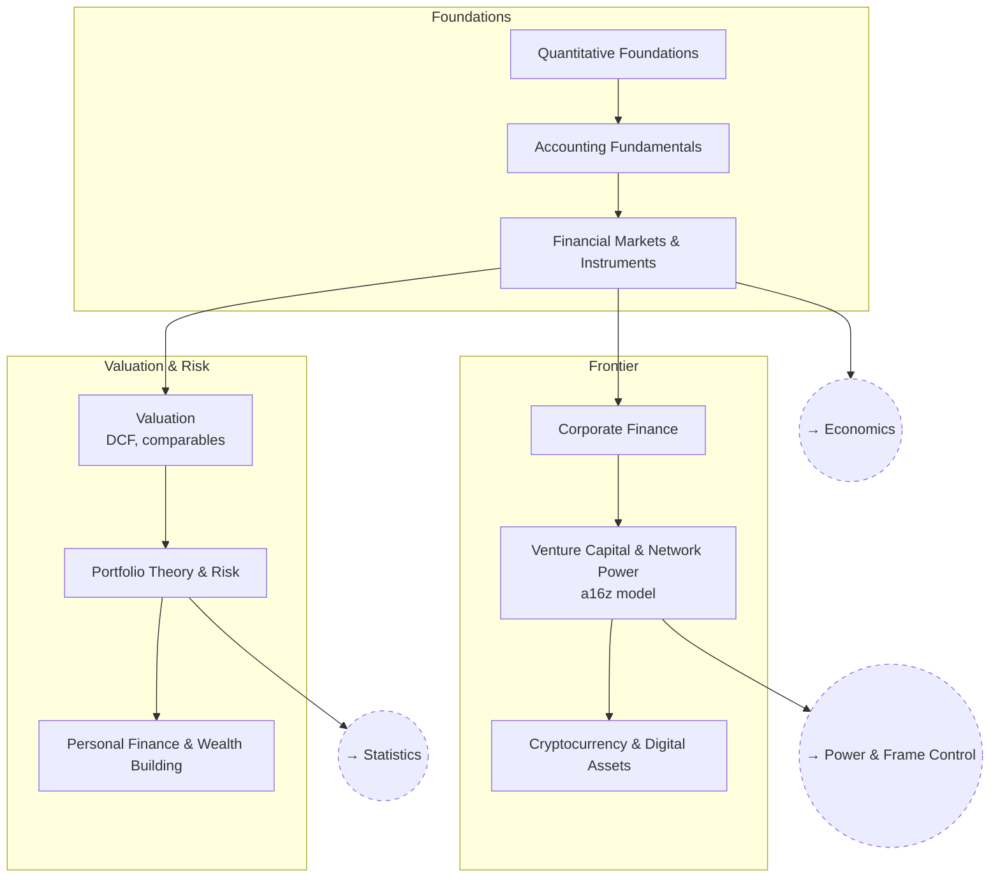

# Finance

From accounting and markets through valuation and portfolio theory, out to
crypto and venture capital.

## Skill Tree

## Nodes

| ID | Concept | Depends on | Status | Resources / Notes |
|---|---|---|---|---|
| FIN_MATH | Quantitative Foundations | — | [ ] | |
| FIN_ACCT | Accounting Fundamentals | FIN_MATH | [ ] | |
| FIN_MARKETS | Financial Markets & Instruments | FIN_ACCT | [ ] | |
| FIN_VALUE | Valuation (DCF, comparables) | FIN_MARKETS | [ ] | |
| FIN_PORT | Portfolio Theory & Risk | FIN_VALUE | [ ] | |
| FIN_PERSONAL | Personal Finance & Wealth Building | FIN_PORT | [ ] | |
| FIN_CORP | Corporate Finance | FIN_MARKETS | [ ] | |
| FIN_VC | Venture Capital & Network Power | FIN_CORP | [ ] | Marc Andreessen, "It's Time to Build"; a16z's American Dynamism thesis |
| FIN_CRYPTO | Cryptocurrency & Digital Assets | FIN_VC | [ ] | |

## Related Trees

- [Economics](economics.md) — `FIN_MARKETS` builds on `ECON_MONEY`.
- [Statistics](statistics.md) — `FIN_PORT` leans on `STAT_MULTI`.
- [Power & Frame Control](power-and-frame-control.md) — `FIN_VC` and
  `PWR_MODERN` are the same subject from two angles.
