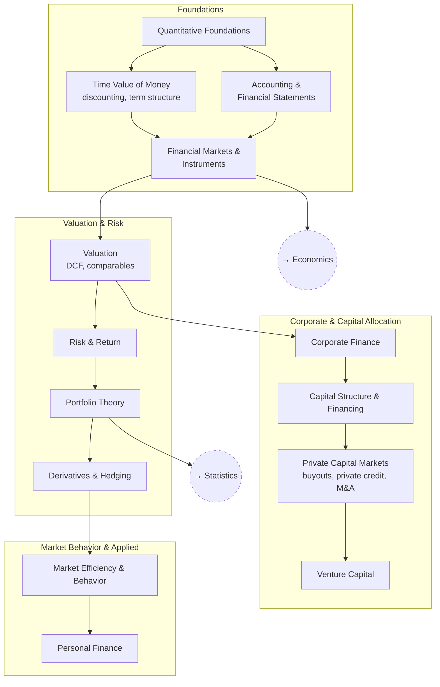

# Finance

How claims on future cash are valued, financed, and traded — built in the
order the subject actually depends on itself: measurement and discounting
first, then valuation and risk, then the firm's own capital decisions,
then what happens when all of it meets a real market.

The structure is the standard architecture of the field. Particular
instruments, asset classes, and current arguments are open questions
*inside* these branches rather than branches of their own.

## Tree

## Articles

**Foundations**
- [Quantitative Foundations](articles/quantitative-foundations.md) — `FIN_MATH`
- [Accounting & Financial Statements](articles/accounting-and-financial-statements.md) — `FIN_ACCT`
- [Time Value of Money](articles/time-value-of-money.md) — `FIN_TVM`
- [Financial Markets & Instruments](articles/financial-markets-and-instruments.md) — `FIN_MARKETS`

**Valuation & Risk**
- [Valuation](articles/valuation.md) — `FIN_VALUE`
- [Risk & Return](articles/risk-and-return.md) — `FIN_RISK`
- [Portfolio Theory](articles/portfolio-theory.md) — `FIN_PORT`
- [Derivatives & Hedging](articles/derivatives-and-hedging.md) — `FIN_DERIV`

**Corporate & Capital Allocation**
- [Corporate Finance](articles/corporate-finance.md) — `FIN_CORP`
- [Capital Structure & Financing](articles/capital-structure.md) — `FIN_CAPSTRUCT`
- [Private Capital Markets](articles/private-capital-markets.md) — `FIN_PRIVATE`
- [Venture Capital](articles/venture-capital.md) — `FIN_VC`

**Market Behavior & Applied**
- [Market Efficiency & Behavior](articles/market-efficiency-and-behavior.md) — `FIN_EFF`
- [Personal Finance](articles/personal-finance.md) — `FIN_PERSONAL`

## Related Trees

- [Economics](../economics/index.md) — money, interest rates, and the
  macro conditions every price here sits inside.
- [Statistics](../statistics/index.md) — estimation and inference, which
  is where most of the quantitative claims in this tree are made or lost.

See also: [Book List](../../BOOKLIST.md).
