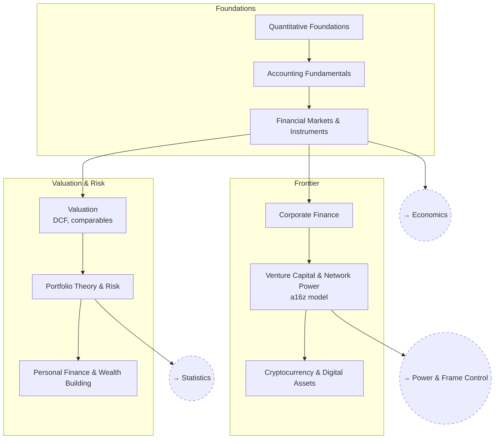

# Finance

From accounting and markets through valuation and portfolio theory, out to
crypto and venture capital.

## Skill Tree

## Sections

- [Foundations](./foundations.md) — `FIN_MATH` `FIN_ACCT` `FIN_MARKETS`
- [Valuation & Risk](./valuation-and-risk.md) — `FIN_VALUE` `FIN_PORT` `FIN_PERSONAL`
- [Frontier](./frontier.md) — `FIN_CORP` `FIN_VC` `FIN_CRYPTO`

See also: [Book List](../../BOOKLIST.md).

## Related Trees

- [Economics](../economics/index.md) — `FIN_MARKETS` builds on
  `ECON_MONEY`.
- [Statistics](../statistics/index.md) — `FIN_PORT` leans on `STAT_MULTI`.
- [Power & Frame Control](../power-and-frame-control/index.md) — `FIN_VC`
  and `PWR_MODERN` are the same subject from two angles.
