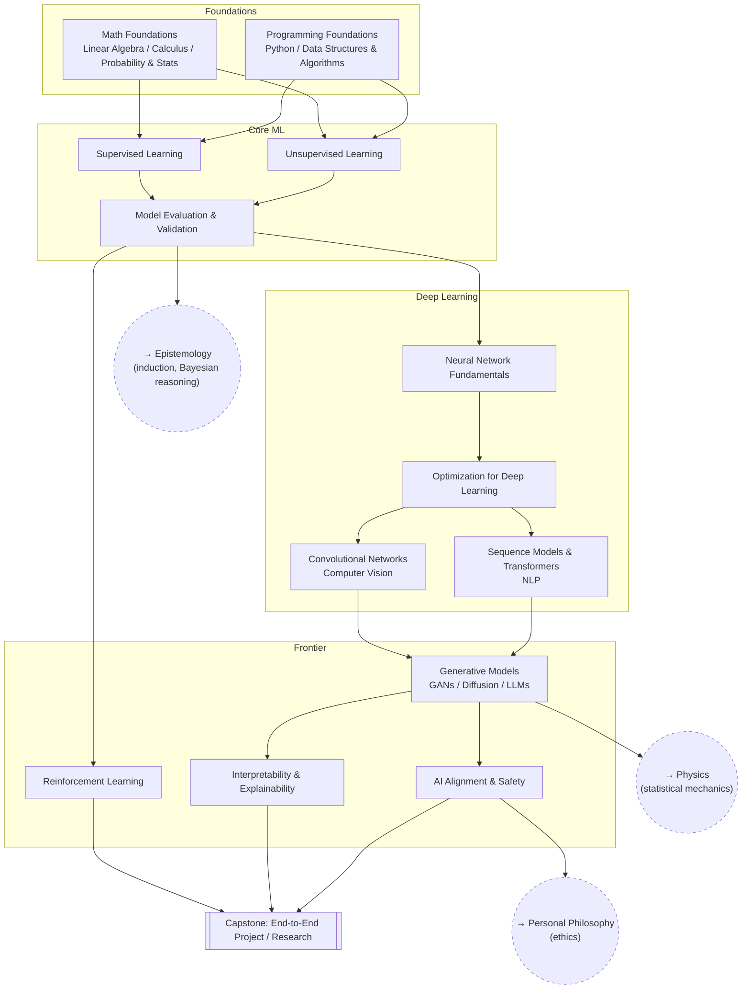

# Machine Learning / AI

From the math and programming groundwork through classical ML, deep
learning, and the frontier topics (generative models, alignment).

## Skill Tree

## Nodes

| ID | Concept | Depends on | Status | Resources / Notes |
|---|---|---|---|---|
| ML_MATH | Math Foundations (linear algebra, calculus, probability & stats) | — | [ ] | |
| ML_PROG | Programming Foundations (Python, data structures & algorithms) | — | [ ] | |
| ML_SUP | Supervised Learning | ML_MATH, ML_PROG | [ ] | |
| ML_UNSUP | Unsupervised Learning | ML_MATH, ML_PROG | [ ] | |
| ML_EVAL | Model Evaluation & Validation | ML_SUP, ML_UNSUP | [ ] | |
| ML_NN | Neural Network Fundamentals | ML_EVAL | [ ] | |
| ML_OPT | Optimization for Deep Learning | ML_NN | [ ] | |
| ML_CNN | Convolutional Networks / Computer Vision | ML_OPT | [ ] | |
| ML_SEQ | Sequence Models & Transformers / NLP | ML_OPT | [ ] | |
| ML_RL | Reinforcement Learning | ML_EVAL | [ ] | |
| ML_GEN | Generative Models (GANs, Diffusion, LLMs) | ML_CNN, ML_SEQ | [ ] | |
| ML_INTERP | Interpretability & Explainability | ML_GEN | [ ] | |
| ML_ALIGN | AI Alignment & Safety | ML_GEN | [ ] | |
| ML_CAPSTONE | **Capstone:** End-to-End Project / Research | ML_RL, ML_INTERP, ML_ALIGN | [ ] | Ship something real, not just a tutorial |

## Related Trees

- [Epistemology](epistemology.md) — `ML_EVAL` is applied Bayesian
  epistemology (`EP_BAYES`); the generalization problem in ML is the
  problem of induction (`EP_SCI`).
- [Physics](physics.md) — `ML_GEN` (especially diffusion models) borrows
  directly from statistical mechanics (`PH_THERMO`).
- [Personal Philosophy](personal-philosophy.md) — `ML_ALIGN` is where
  applied ethics (`PP_ETH_APP`) and political philosophy (`PP_POL`) meet
  real systems.
