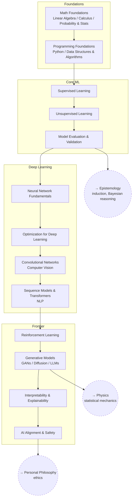

# Machine Learning / AI

The groundwork, the classical methods, deep learning, and the frontier —
built as the field's own dependency order rather than as a tour of
whatever is currently loud. Theory has trailed practice here for a
decade, so a lot of the real content is knowing which explanations are
established and which are stories told after the fact.

Specific systems, papers, and current arguments belong as open questions
inside the relevant article, not as branches of their own.

## Tree

## Articles

**Foundations**
- [Math Foundations](articles/math-foundations.md) — `ML_MATH`
- [Programming Foundations](articles/programming-foundations.md) — `ML_PROG`

**Core ML**
- [Supervised Learning](articles/supervised-learning.md) — `ML_SUP`
- [Unsupervised Learning](articles/unsupervised-learning.md) — `ML_UNSUP`
- [Model Evaluation & Validation](articles/model-evaluation-and-validation.md) — `ML_EVAL`

**Deep Learning**
- [Neural Network Fundamentals](articles/neural-network-fundamentals.md) — `ML_NN`
- [Optimization for Deep Learning](articles/optimization-for-deep-learning.md) — `ML_OPT`
- [Convolutional Networks](articles/convolutional-networks.md) — `ML_CNN`
- [Sequence Models & Transformers](articles/sequence-models-and-transformers.md) — `ML_SEQ`

**Frontier**
- [Reinforcement Learning](articles/reinforcement-learning.md) — `ML_RL`
- [Generative Models](articles/generative-models.md) — `ML_GEN`
- [Interpretability & Explainability](articles/interpretability-and-explainability.md) — `ML_INTERP`
- [AI Alignment & Safety](articles/ai-alignment-and-safety.md) — `ML_ALIGN`

## Related Trees

- [Epistemology](../epistemology/index.md) — generalization is the problem
  of induction, and model evaluation is applied Bayesian reasoning.
- [Statistics](../statistics/index.md) — the inference and estimation
  theory underneath all of it.
- [Physics](../physics/index.md) — statistical mechanics, which diffusion
  models borrow from directly.
- [Personal Philosophy](../personal-philosophy/index.md) — where alignment
  stops being a technical question and becomes an ethical one.

See also: [Book List](../../BOOKLIST.md).
