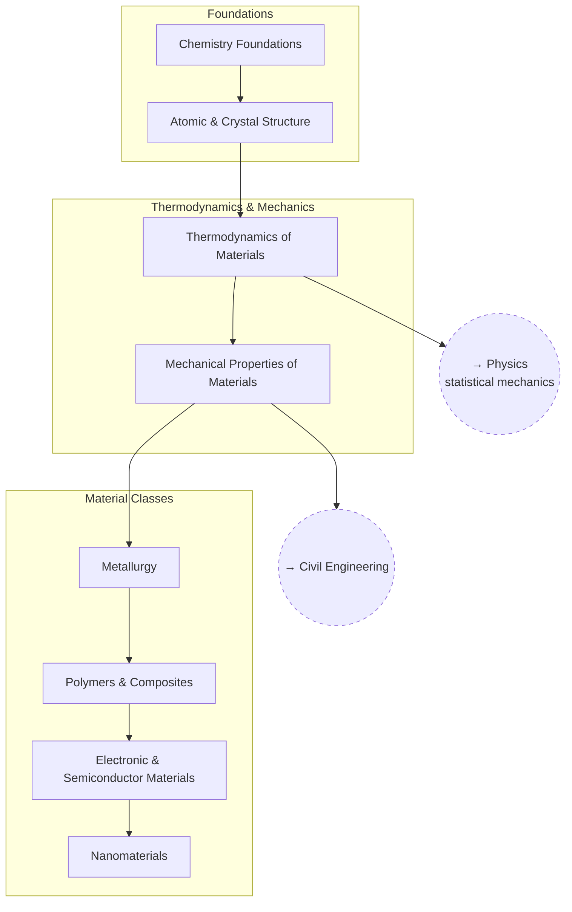

# Materials Science

Why materials behave the way they do, from crystal structure up to
engineered composites and semiconductors.

## Skill Tree

## Nodes

| ID | Concept | Depends on | Status | Resources / Notes |
|---|---|---|---|---|
| MAT_CHEM | Chemistry Foundations | — | [ ] | |
| MAT_STRUCT | Atomic & Crystal Structure | MAT_CHEM | [ ] | |
| MAT_THERMO | Thermodynamics of Materials | MAT_STRUCT | [ ] | |
| MAT_MECH | Mechanical Properties of Materials | MAT_THERMO | [ ] | |
| MAT_METALS | Metallurgy | MAT_MECH | [ ] | |
| MAT_POLYMER | Polymers & Composites | MAT_METALS | [ ] | |
| MAT_ELEC | Electronic & Semiconductor Materials | MAT_POLYMER | [ ] | |
| MAT_NANO | Nanomaterials | MAT_ELEC | [ ] | |

## Related Trees

- [Physics](physics.md) — `MAT_THERMO` and `MAT_ELEC` build on `PH_THERMO`
  and `PH_COND`.
- [Civil Engineering](civil-engineering.md) — `MAT_MECH` underlies
  `CE_MECH`.
- [Biology](biology.md) — `MAT_CHEM` overlaps with `BIO_CHEM`.
