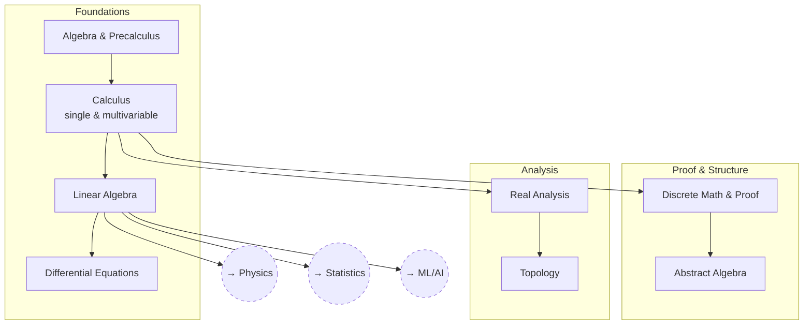

# Mathematics

The general-purpose toolkit that everything else — physics, statistics, ML,
engineering — draws on.

## Skill Tree

## Nodes

| ID | Concept | Depends on | Status | Resources / Notes |
|---|---|---|---|---|
| MATH_ALGEBRA | Algebra & Precalculus | — | [ ] | |
| MATH_CALC | Calculus (single & multivariable) | MATH_ALGEBRA | [ ] | |
| MATH_LINALG | Linear Algebra | MATH_CALC | [ ] | |
| MATH_DIFFEQ | Differential Equations | MATH_LINALG | [ ] | |
| MATH_DISCRETE | Discrete Math & Proof | MATH_CALC | [ ] | |
| MATH_ABSTRACT | Abstract Algebra | MATH_DISCRETE | [ ] | |
| MATH_REALANAL | Real Analysis | MATH_CALC | [ ] | |
| MATH_TOPOLOGY | Topology | MATH_REALANAL | [ ] | |

## Related Trees

- [Physics](physics.md) — `MATH_LINALG` and `MATH_DIFFEQ` are prerequisites
  for `PH_CLASS` onward.
- [Statistics](statistics.md) — `MATH_LINALG` and `MATH_REALANAL` underlie
  `STAT_PROB`.
- [Machine Learning / AI](machine-learning-ai.md) — `MATH_LINALG` is
  `ML_MATH`'s core.
- [Civil Engineering](civil-engineering.md) and
  [Materials Science](materials-science.md) both build directly on
  `MATH_DIFFEQ`.
