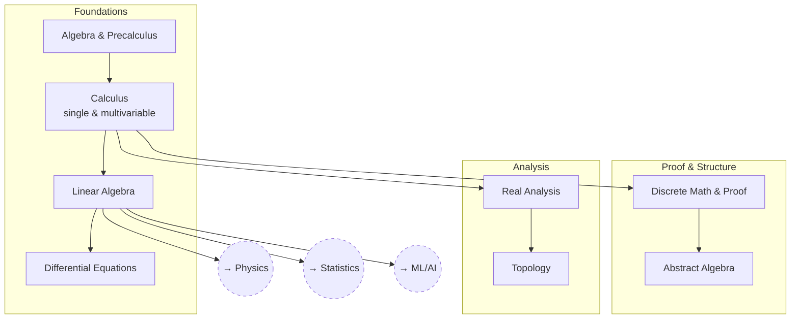

# Mathematics

The general-purpose toolkit that everything else — physics, statistics, ML,
engineering — draws on, and a set of questions about what that toolkit
actually is.

The arrows below are order of dependence. The questions inside each article
mostly are not about technique; they're about what the subject is doing and
what its choices commit you to.

## Tree

## Articles

**Foundations**
- [Algebra & Precalculus](articles/algebra-and-precalculus.md) — `MATH_ALGEBRA`
- [Calculus](articles/calculus.md) — `MATH_CALC`
- [Linear Algebra](articles/linear-algebra.md) — `MATH_LINALG`
- [Differential Equations](articles/differential-equations.md) — `MATH_DIFFEQ`

**Proof & Structure**
- [Discrete Math & Proof](articles/discrete-math-and-proof.md) — `MATH_DISCRETE`
- [Abstract Algebra](articles/abstract-algebra.md) — `MATH_ABSTRACT`

**Analysis**
- [Real Analysis](articles/real-analysis.md) — `MATH_REALANAL`
- [Topology](articles/topology.md) — `MATH_TOPOLOGY`

## Related Trees

- [Physics](../physics/index.md) — `MATH_LINALG` and `MATH_DIFFEQ` are
  prerequisites for `PH_CLASS` onward.
- [Statistics](../statistics/index.md) — `MATH_LINALG` and `MATH_REALANAL`
  underlie `STAT_PROB`.
- [Machine Learning / AI](../machine-learning-ai/index.md) — `MATH_LINALG` is
  `ML_MATH`'s core.
- [Civil Engineering](../civil-engineering/index.md) and
  [Materials Science](../materials-science/index.md) both build directly on
  `MATH_DIFFEQ`.

See also: [Book List](../../BOOKLIST.md).
