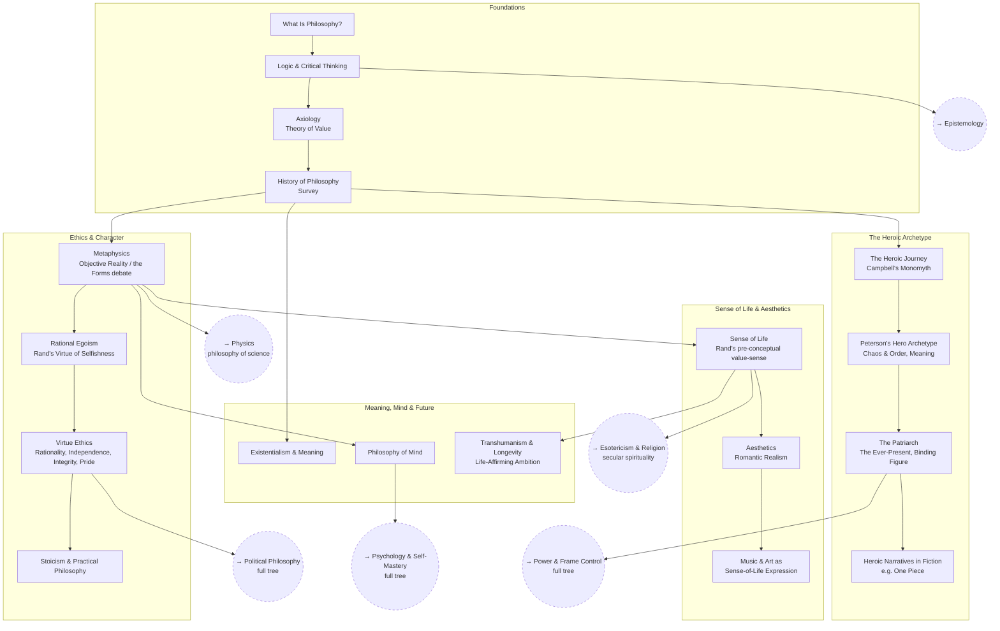

# Personal Philosophy

Building a coherent, examined worldview: how to think clearly, what's
actually good, what a life well-lived looks like, and how to live by it.
Heavily shaped by Ayn Rand's Objectivism ([SEP entry](https://plato.stanford.edu/entries/ayn-rand/))
and Jordan Peterson's work on meaning and mythic archetypes.

## Skill Tree

## Nodes

| ID | Concept | Depends on | Status | Resources / Notes |
|---|---|---|---|---|
| PP_WHATIS | What Is Philosophy? | — | [ ] | |
| PP_LOGIC | Logic & Critical Thinking | PP_WHATIS | [ ] | |
| PP_AXIO | Axiology (theory of value) | PP_LOGIC | [ ] | |
| PP_HIST | History of Philosophy (survey) | PP_AXIO | [ ] | |
| PP_META | Metaphysics (objective reality, Platonic Forms debate) | PP_HIST | [ ] | |
| PP_EGO | Rational Egoism | PP_META | [ ] | Ayn Rand, *The Virtue of Selfishness*; [SEP: Ayn Rand](https://plato.stanford.edu/entries/ayn-rand/) |
| PP_VIRTUE | Virtue Ethics (rationality, independence, integrity, justice, productiveness, pride) | PP_EGO | [ ] | Rand's list of rational virtues; Aristotle, *Nicomachean Ethics* for contrast |
| PP_STOIC | Stoicism & Practical Philosophy | PP_VIRTUE | [ ] | |
| PP_SENSE | Sense of Life | PP_META | [ ] | Rand, *The Romantic Manifesto* — ch. on sense of life as "a pre-conceptual equivalent of metaphysics" |
| PP_AES | Aesthetics (Romantic Realism) | PP_SENSE | [ ] | Rand, *The Romantic Manifesto* |
| PP_MUSIC | Music & Art as sense-of-life expression | PP_AES | [ ] | |
| PP_HERO | The Heroic Journey | PP_HIST | [ ] | Joseph Campbell, *The Hero with a Thousand Faces* |
| PP_PETERSON | Peterson's Hero Archetype (chaos & order, meaning) | PP_HERO | [ ] | Jordan Peterson, *Maps of Meaning*; *12 Rules for Life* |
| PP_PATRIARCH | The Patriarch — the ever-present, binding figure | PP_PETERSON | [ ] | Peterson on paternal archetypes; Jung on symbols of the father |
| PP_NARR | Heroic narratives in fiction | PP_PATRIARCH | [ ] | e.g. *One Piece* as a modern monomyth case study |
| PP_EXIS | Existentialism & Meaning | PP_HIST | [ ] | |
| PP_MIND | Philosophy of Mind | PP_META | [ ] | |
| PP_TRANS | Transhumanism & Longevity | PP_SENSE | [ ] | Life-affirming, achievement-oriented "technosupremacy" angle |

## Related Trees

- [Political Philosophy](political-philosophy.md) — off of `PP_VIRTUE`: the
  deep dive into root political principles.
- [Psychology & Self-Mastery](psychology-self-mastery.md) — off of `PP_MIND`:
  controlling your own mind, building the ideal-self concept.
- [Power & Frame Control](power-and-frame-control.md) — off of
  `PP_PATRIARCH`: the patriarch as a power/frame-control archetype.
- [Esotericism & Religion](esotericism-and-religion.md) — off of `PP_SENSE`:
  a secular, useful account of the "spiritual."
- [Epistemology](epistemology.md) — how you justify what you believe
  underlies both ethics and metaphysics.
- [Physics](physics.md) — `PP_META`'s questions about causation and
  determinism connect to `PH_PHILO` (interpretations of QM).
