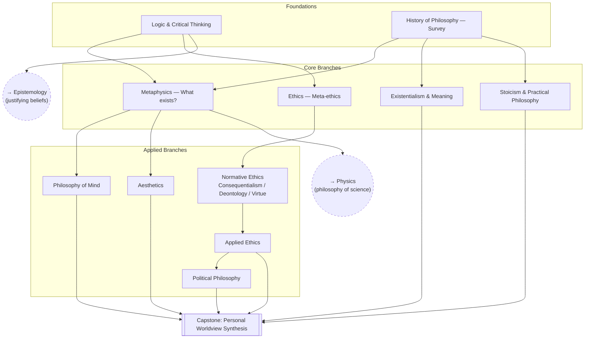

# Personal Philosophy

Building a coherent, examined worldview: how to think clearly, what's
actually good, what a life well-lived looks like, and how to live by it.

## Skill Tree

## Nodes

| ID | Concept | Depends on | Status | Resources / Notes |
|---|---|---|---|---|
| PP_LOGIC | Logic & Critical Thinking | — | [ ] | |
| PP_HIST | History of Philosophy (survey) | — | [ ] | |
| PP_META | Metaphysics | PP_LOGIC, PP_HIST | [ ] | |
| PP_ETH | Ethics: Meta-ethics | PP_LOGIC | [ ] | |
| PP_EXIS | Existentialism & Meaning | PP_HIST | [ ] | |
| PP_STOIC | Stoicism & Practical Philosophy | PP_HIST | [ ] | |
| PP_ETH_NORM | Normative Ethics (consequentialism, deontology, virtue ethics) | PP_ETH | [ ] | |
| PP_ETH_APP | Applied Ethics | PP_ETH_NORM | [ ] | |
| PP_POL | Political Philosophy | PP_ETH_APP | [ ] | |
| PP_MIND | Philosophy of Mind | PP_META | [ ] | |
| PP_AES | Aesthetics | PP_META | [ ] | |
| PP_SYNTH | **Capstone:** Personal Worldview Synthesis | PP_ETH_APP, PP_EXIS, PP_STOIC, PP_POL, PP_MIND, PP_AES | [ ] | Write it down somewhere, not just in your head |

## Related Trees

- [Epistemology](epistemology.md) — how you justify what you believe underlies
  both ethics and metaphysics; start there in parallel with `PP_LOGIC`.
- [Physics](physics.md) — metaphysics questions (causation, determinism, the
  nature of time) connect directly to `PH_PHILO` (interpretations of QM /
  philosophy of space & time).
- [Machine Learning / AI](machine-learning-ai.md) — `PP_ETH_APP` and `PP_POL`
  feed into `ML_ALIGN` (AI alignment & safety).
