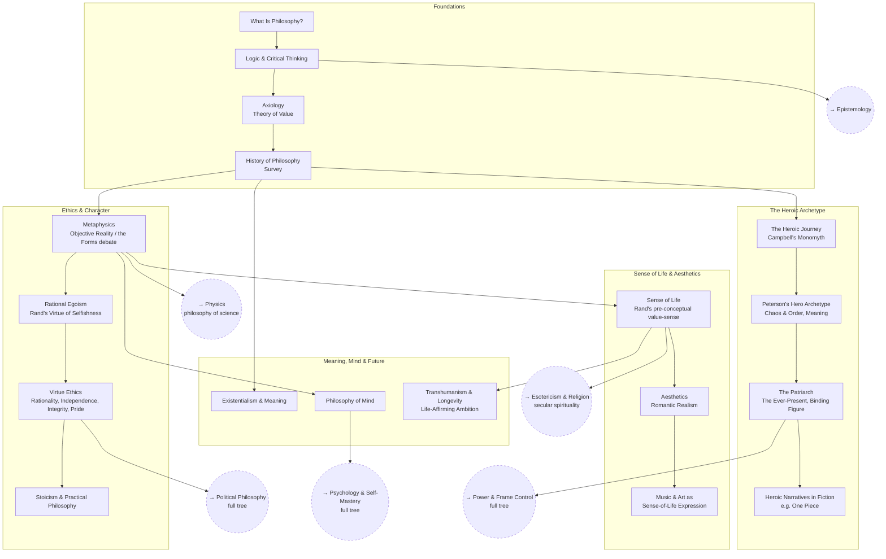

# Personal Philosophy

Building a coherent, examined worldview: how to think clearly, what's
actually good, what a life well-lived looks like, and how to live by it.
Heavily shaped by Ayn Rand's Objectivism ([SEP entry](https://plato.stanford.edu/entries/ayn-rand/))
and Jordan Peterson's work on meaning and mythic archetypes.

This tree is structured as **open questions**, not a checklist — the goal
isn't to "complete" a node, it's to arrive at (and keep revising) an actual
answer. Each section file has the questions, a place for the current
answer, and the resources behind it.

## Skill Tree

## Sections

- [Foundations](./foundations.md) — `PP_WHATIS` `PP_LOGIC` `PP_AXIO` `PP_HIST`
- [Ethics & Character](./ethics-and-character.md) — `PP_META` `PP_EGO` `PP_VIRTUE` `PP_STOIC`
- [Sense of Life & Aesthetics](./sense-of-life-and-aesthetics.md) — `PP_SENSE` `PP_AES` `PP_MUSIC`
- [The Heroic Archetype](./the-heroic-archetype.md) — `PP_HERO` `PP_PETERSON` `PP_PATRIARCH` `PP_NARR`
- [Meaning, Mind & Future](./meaning-mind-and-future.md) — `PP_EXIS` `PP_MIND` `PP_TRANS`

See also: [Book List](../../BOOKLIST.md).

## Related Trees

- [Political Philosophy](../political-philosophy/index.md) — off of the
  Ethics & Character section: the deep dive into root political principles.
- [Psychology & Self-Mastery](../psychology-self-mastery/index.md) — off of
  Meaning, Mind & Future: controlling your own mind, building the
  ideal-self concept.
- [Power & Frame Control](../power-and-frame-control/index.md) — off of The
  Heroic Archetype: the patriarch as a power/frame-control archetype.
- [Esotericism & Religion](../esotericism-and-religion/index.md) — off of
  Sense of Life & Aesthetics: a secular, useful account of the "spiritual."
- [Epistemology](../epistemology/index.md) — how you justify what you
  believe underlies both ethics and metaphysics.
- [Physics](../physics/index.md) — the metaphysics questions here connect to
  interpretations of QM.
