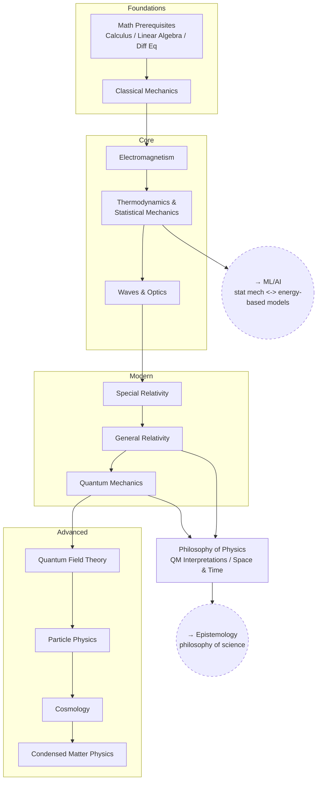

# Physics

From the math prerequisites through classical and modern physics to the
open questions at the edges of the field.

## Skill Tree

## Nodes

| ID | Concept | Depends on | Status | Resources / Notes |
|---|---|---|---|---|
| PH_MATH | Math prerequisites | — | [ ] | |
| PH_CLASS | Classical Mechanics | PH_MATH | [ ] | |
| PH_EM | Electromagnetism | PH_CLASS | [ ] | |
| PH_THERMO | Thermodynamics & Statistical Mechanics | PH_EM | [ ] | |
| PH_WAVES | Waves & Optics | PH_THERMO | [ ] | |
| PH_SR | Special Relativity | PH_WAVES | [ ] | |
| PH_GR | General Relativity | PH_SR | [ ] | |
| PH_QM | Quantum Mechanics | PH_GR | [ ] | |
| PH_QFT | Quantum Field Theory | PH_QM | [ ] | |
| PH_PARTICLE | Particle Physics | PH_QFT | [ ] | |
| PH_COSMO | Cosmology | PH_PARTICLE | [ ] | |
| PH_COND | Condensed Matter Physics | PH_COSMO | [ ] | |
| PH_PHILO | Philosophy of Physics (QM interpretations, space & time) | PH_QM, PH_GR | [ ] | |

## Related Trees

- [Epistemology](epistemology.md) — `PH_PHILO` is a direct application of
  `EP_SCI` (induction/falsifiability).
- [Machine Learning / AI](machine-learning-ai.md) — `PH_THERMO` (statistical
  mechanics) shares its math with `ML_GEN` (diffusion models are literally
  simulated thermodynamics).
- [Materials Science](materials-science.md) — `PH_THERMO` and `PH_COND`
  underlie `MAT_THERMO` and `MAT_ELEC`.
- [Personal Philosophy](personal-philosophy.md) — `PH_PHILO`'s questions
  about determinism and the nature of time bear on `PP_META`.
