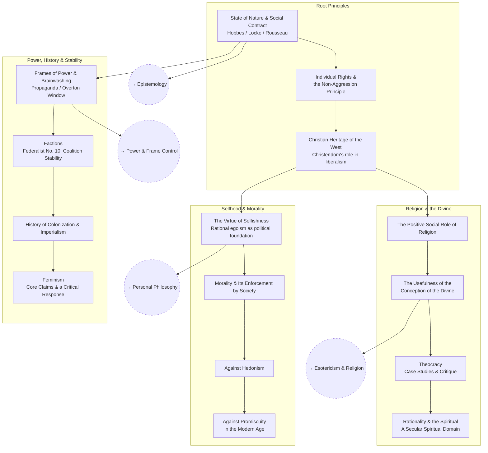

# Political Philosophy

Fleshing out political positions all the way down to root principles — well
enough to argue them, and well enough to counter them. **Approach: steelman
the strongest version of a position before building the counter-case.** A
counter to a strawman isn't worth having.

## Skill Tree

## Nodes

| ID | Concept | Depends on | Status | Resources / Notes |
|---|---|---|---|---|
| POL_ROOT | State of Nature & Social Contract | — | [ ] | Hobbes, *Leviathan*; Locke, *Second Treatise of Government* |
| POL_RIGHTS | Individual Rights & the Non-Aggression Principle | POL_ROOT | [ ] | Nozick, *Anarchy, State, and Utopia* |
| POL_CHRISTIAN | Christian Heritage of the West | POL_RIGHTS | [ ] | Tom Holland, *Dominion*; Larry Siedentop, *Inventing the Individual* |
| POL_SELFISH | The Virtue of Selfishness | POL_CHRISTIAN | [ ] | Ayn Rand, *The Virtue of Selfishness*; [SEP: Ayn Rand](https://plato.stanford.edu/entries/ayn-rand/) |
| POL_MORAL | Morality & Its Enforcement by Society | POL_SELFISH | [ ] | Jonathan Haidt, *The Righteous Mind* |
| POL_HEDON | Against Hedonism | POL_MORAL | [ ] | Rand's critique of hedonism vs. Aristotelian eudaimonia |
| POL_PROMISC | Against Promiscuity in the Modern Age | POL_HEDON | [ ] | Peterson's lectures on monogamy & pair-bonding |
| POL_RELIGION | The Positive Social Role of Religion | POL_CHRISTIAN | [ ] | Peterson, *Maps of Meaning* |
| POL_DIVINE | The Usefulness of the Conception of the Divine | POL_RELIGION | [ ] | Jung, *Answer to Job*; Peterson's Biblical psychology lectures |
| POL_THEOCRACY | Theocracy — Case Studies & Critique | POL_DIVINE | [ ] | Case studies: Calvin's Geneva, post-1979 Iran |
| POL_SPIRIT | Rationality & the Spiritual (a secular spiritual domain) | POL_THEOCRACY | [ ] | Jung, *Psychology and Religion* |
| POL_FRAMES | Frames of Power & Brainwashing | POL_ROOT | [ ] | Bernays, *Propaganda*; Lakoff, *Don't Think of an Elephant* |
| POL_FACTIONS | Factions & Coalition Stability | POL_FRAMES | [ ] | Madison, *Federalist No. 10* |
| POL_COLONIAL | History of Colonization & Imperialism | POL_FACTIONS | [ ] | Niall Ferguson, *Empire*; steelman: Edward Said, *Orientalism* |
| POL_FEMINISM | Feminism — core claims & a critical response | POL_COLONIAL | [ ] | Steelman: bell hooks, *Feminism Is for Everybody*; critical: Camille Paglia, *Sexual Personae*; Christina Hoff Sommers, *Who Stole Feminism?* |

## Related Trees

- [Personal Philosophy](personal-philosophy.md) — `POL_SELFISH` is the
  political extension of `PP_EGO`.
- [Esotericism & Religion](esotericism-and-religion.md) — `POL_DIVINE` and
  `POL_THEOCRACY` connect to `ES_GNOSTIC` and `ES_SECULAR`.
- [Power & Frame Control](power-and-frame-control.md) — `POL_FRAMES` is the
  political-theory side of `PWR_PROP`.
- [Epistemology](epistemology.md) — root-principles reasoning depends on
  `EP_JUST` (theories of justification).
- [Economics](economics.md) — `POL_FACTIONS` overlaps with the game theory
  of coalitions in `ECON_GAME`.
