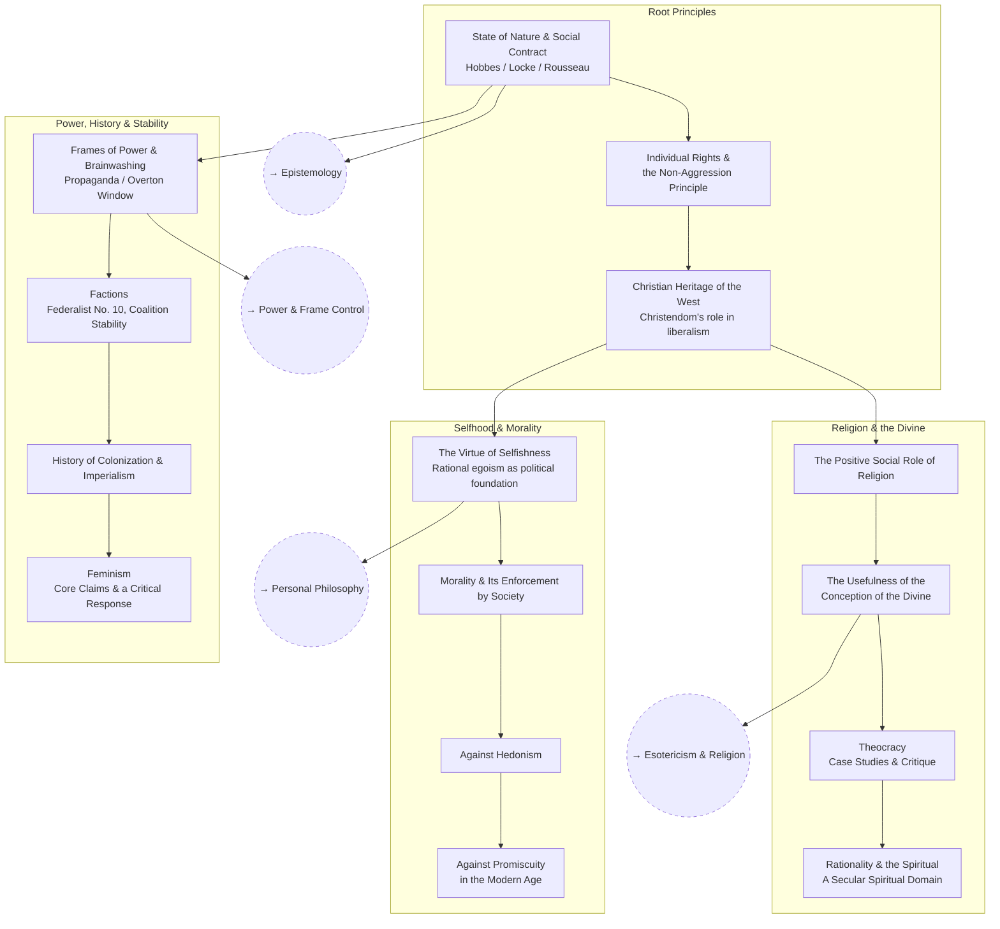

# Political Philosophy

Fleshing out political positions all the way down to root principles — well
enough to argue them, and well enough to counter them.

This tree is structured as **open questions**, not a checklist. For every
contested question below: **steelman the strongest version of the position
you disagree with before writing your own answer.** A counter to a
strawman isn't worth having, and it won't survive contact with someone who
actually knows the material.

## Skill Tree

## Sections

- [Root Principles](./root-principles.md) — `POL_ROOT` `POL_RIGHTS` `POL_CHRISTIAN`
- [Selfhood & Morality](./selfhood-and-morality.md) — `POL_SELFISH` `POL_MORAL` `POL_HEDON` `POL_PROMISC`
- [Religion & the Divine](./religion-and-the-divine.md) — `POL_RELIGION` `POL_DIVINE` `POL_THEOCRACY` `POL_SPIRIT`
- [Power, History & Stability](./power-history-and-stability.md) — `POL_FRAMES` `POL_FACTIONS` `POL_COLONIAL` `POL_FEMINISM`

See also: [Book List](../../BOOKLIST.md).

## Related Trees

- [Personal Philosophy](../personal-philosophy/index.md) — `POL_SELFISH` is
  the political extension of rational egoism.
- [Esotericism & Religion](../esotericism-and-religion/index.md) —
  `POL_DIVINE` and `POL_THEOCRACY` connect to Gnosticism and secular
  spirituality there.
- [Power & Frame Control](../power-and-frame-control/index.md) —
  `POL_FRAMES` is the political-theory side of propaganda technique.
- [Epistemology](../epistemology/index.md) — root-principles reasoning
  depends on theories of justification.
- [Economics](../economics/index.md) — `POL_FACTIONS` overlaps with the
  game theory of coalitions.
