# Political Philosophy

Working political positions down to root principles — far enough down that
they can be defended, and far enough that the opposing ones can be
countered at the root rather than at the slogan.

The structure is the standard architecture of political philosophy.
Specific contemporary disputes live as open questions inside the branch
they actually belong to. **Every contested question here gets the
steelman first** — reconstruct the opposing position at its strongest
before answering it, or the answer is worthless.

## Tree

```mermaid
flowchart TD
    subgraph Foundations
        POL_NATURE[Human Nature &<br/>What Politics Must Assume]
        POL_UNIT[The Unit of Analysis<br/>individual & collective]
        POL_NATURE --> POL_UNIT
    end

    subgraph "Legitimacy & Authority"
        POL_LEGIT[What Makes Power Legitimate]
        POL_CONTRACT[Consent & the Social Contract]
        POL_OBLIGATION[Political Obligation & Disobedience]
        POL_LEGIT --> POL_CONTRACT --> POL_OBLIGATION
    end

    subgraph "Rights & Justice"
        POL_RIGHTS[What Grounds Rights]
        POL_LIBERTY[Liberty & Its Limits]
        POL_PROPERTY[Property & Ownership]
        POL_JUSTICE[Justice & Distribution]
        POL_RIGHTS --> POL_LIBERTY --> POL_PROPERTY --> POL_JUSTICE
    end

    subgraph "The State"
        POL_SCOPE[Proper Scope of the State]
        POL_FORMS[Forms of Government]
        POL_LAW[Law & Enforcement]
        POL_SCOPE --> POL_FORMS --> POL_LAW
    end

    subgraph "Society & Culture"
        POL_MORALENF[Morality & Social Enforcement]
        POL_RELIGION[Religion & Political Order]
        POL_FAMILY[Family, Sex & Social Reproduction]
        POL_COHESION[Faction, Cohesion & Group Stability]
        POL_TRADITION[Tradition & Inheritance]
        POL_MORALENF --> POL_RELIGION --> POL_FAMILY --> POL_COHESION --> POL_TRADITION
    end

    subgraph "Conflict & Change"
        POL_IDEOLOGY[Ideology, Persuasion & Manufactured Belief]
        POL_EMPIRE[Empire, Conquest & Historical Power]
        POL_CHANGE[Revolution & Political Change]
        POL_IDEOLOGY --> POL_EMPIRE --> POL_CHANGE
    end

    POL_UNIT --> POL_LEGIT
    POL_OBLIGATION --> POL_RIGHTS
    POL_JUSTICE --> POL_SCOPE
    POL_LAW --> POL_MORALENF
    POL_TRADITION --> POL_IDEOLOGY

    classDef crosslink stroke-dasharray: 5 5
    POL_PP(("→ Personal Philosophy")):::crosslink
    POL_PWR(("→ Power & Frame Control")):::crosslink
    POL_ES(("→ Esotericism & Religion")):::crosslink
    POL_ECON(("→ Economics")):::crosslink
    POL_UNIT --> POL_PP
    POL_IDEOLOGY --> POL_PWR
    POL_RELIGION --> POL_ES
    POL_PROPERTY --> POL_ECON
```

## Articles

**Foundations**
- [Human Nature & What Politics Must Assume](articles/human-nature.md) — `POL_NATURE`
- [The Unit of Analysis](articles/the-unit-of-analysis.md) — `POL_UNIT`

**Legitimacy & Authority**
- [What Makes Power Legitimate](articles/legitimacy.md) — `POL_LEGIT`
- [Consent & the Social Contract](articles/consent-and-the-social-contract.md) — `POL_CONTRACT`
- [Political Obligation & Disobedience](articles/political-obligation.md) — `POL_OBLIGATION`

**Rights & Justice**
- [What Grounds Rights](articles/what-grounds-rights.md) — `POL_RIGHTS`
- [Liberty & Its Limits](articles/liberty-and-its-limits.md) — `POL_LIBERTY`
- [Property & Ownership](articles/property-and-ownership.md) — `POL_PROPERTY`
- [Justice & Distribution](articles/justice-and-distribution.md) — `POL_JUSTICE`

**The State**
- [Proper Scope of the State](articles/scope-of-the-state.md) — `POL_SCOPE`
- [Forms of Government](articles/forms-of-government.md) — `POL_FORMS`
- [Law & Enforcement](articles/law-and-enforcement.md) — `POL_LAW`

**Society & Culture**
- [Morality & Social Enforcement](articles/morality-and-social-enforcement.md) — `POL_MORALENF`
- [Religion & Political Order](articles/religion-and-political-order.md) — `POL_RELIGION`
- [Family, Sex & Social Reproduction](articles/family-sex-and-social-reproduction.md) — `POL_FAMILY`
- [Faction, Cohesion & Group Stability](articles/faction-and-cohesion.md) — `POL_COHESION`
- [Tradition & Inheritance](articles/tradition-and-inheritance.md) — `POL_TRADITION`

**Conflict & Change**
- [Ideology, Persuasion & Manufactured Belief](articles/ideology-and-persuasion.md) — `POL_IDEOLOGY`
- [Empire, Conquest & Historical Power](articles/empire-and-conquest.md) — `POL_EMPIRE`
- [Revolution & Political Change](articles/revolution-and-change.md) — `POL_CHANGE`

## Related Trees

- [Personal Philosophy](../personal-philosophy/index.md) — the ethics this
  extends from.
- [Power & Frame Control](../power-and-frame-control/index.md) — how power
  actually operates, as opposed to how it's justified.
- [Esotericism & Religion](../esotericism-and-religion/index.md) — what
  religion is doing that political order depends on.
- [Economics](../economics/index.md) — property, distribution, and the
  material constraints on any political arrangement.

See also: [Book List](../../BOOKLIST.md).
