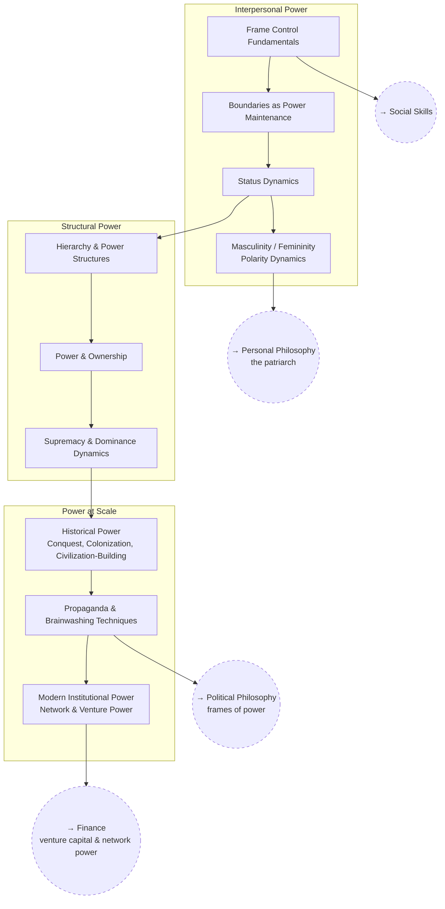

# Power & Frame Control

How power, status, and frames actually work — from interpersonal dynamics
up to civilizational-scale power structures.

## Skill Tree

## Nodes

| ID | Concept | Depends on | Status | Resources / Notes |
|---|---|---|---|---|
| PWR_FRAME | Frame Control Fundamentals | — | [ ] | |
| PWR_BOUND | Boundaries as Power Maintenance | PWR_FRAME | [ ] | |
| PWR_STATUS | Status Dynamics | PWR_BOUND | [ ] | |
| PWR_POLARITY | Masculinity / Femininity Polarity Dynamics | PWR_STATUS | [ ] | |
| PWR_HIER | Hierarchy & Power Structures | PWR_STATUS | [ ] | |
| PWR_OWNER | Power & Ownership | PWR_HIER | [ ] | |
| PWR_DOMINANCE | Supremacy & Dominance Dynamics | PWR_OWNER | [ ] | |
| PWR_HISTORY | Historical Power (conquest, colonization, civilization-building) | PWR_DOMINANCE | [ ] | Case studies drawn from `POL_COLONIAL` |
| PWR_PROP | Propaganda & Brainwashing Techniques | PWR_HISTORY | [ ] | Bernays, *Propaganda* |
| PWR_MODERN | Modern Institutional Power (network & venture power) | PWR_PROP | [ ] | Marc Andreessen, "It's Time to Build"; a16z's American Dynamism thesis |

## Related Trees

- [Social Skills](social-skills.md) — `PWR_FRAME` is the base layer under
  `SOC_PERSUADE` and `SOC_INFLUENCE`.
- [Political Philosophy](political-philosophy.md) — `PWR_PROP` is the
  applied side of `POL_FRAMES`.
- [Personal Philosophy](personal-philosophy.md) — `PWR_POLARITY` connects to
  `PP_PATRIARCH`.
- [Finance](finance.md) — `PWR_MODERN` and `FIN_VC` are the same subject
  from two angles.
