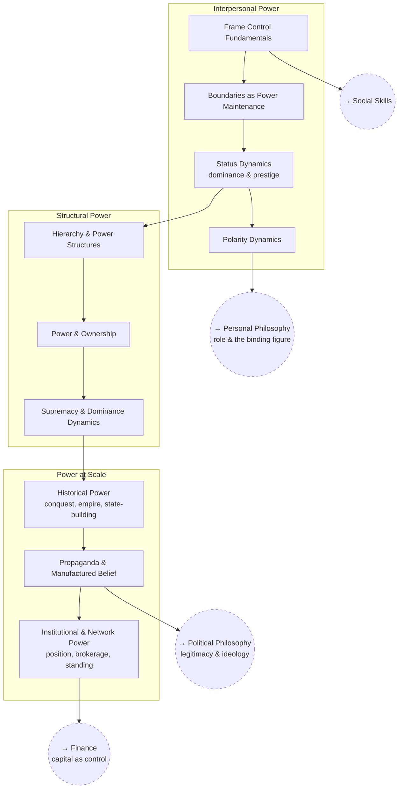

# Power & Frame Control

How power, status, and frames actually operate — as opposed to how they get
justified — from a single conversation up to civilizational scale.

## Tree

## Related Trees

- [Social Skills](../social-skills/index.md) — frame control is the base
  layer under persuasion and influence.
- [Political Philosophy](../political-philosophy/index.md) — where the same
  phenomena get argued about as legitimacy rather than as mechanics.
- [Personal Philosophy](../personal-philosophy/index.md) — what occupying a
  position of power does to the person occupying it.
- [Finance](../finance/index.md) — where the allocation of capital becomes
  a form of institutional power.

- [Social Identity](../../personal/social-identity.md) — identity as the
  thing being claimed, granted, and contested.

See also: [Book List](../../BOOKLIST.md).
