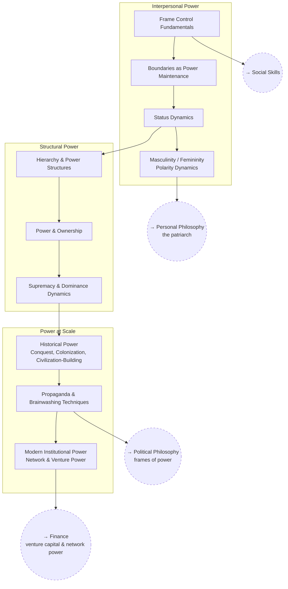

# Power & Frame Control

How power, status, and frames actually work — from interpersonal dynamics
up to civilizational-scale power structures.

## Skill Tree

## Sections

- [Interpersonal Power](./interpersonal-power.md) — `PWR_FRAME` `PWR_BOUND` `PWR_STATUS` `PWR_POLARITY`
- [Structural Power](./structural-power.md) — `PWR_HIER` `PWR_OWNER` `PWR_DOMINANCE`
- [Power at Scale](./power-at-scale.md) — `PWR_HISTORY` `PWR_PROP` `PWR_MODERN`

See also: [Book List](../../BOOKLIST.md).

## Related Trees

- [Social Skills](../social-skills/index.md) — frame control is the base
  layer under persuasion and influence.
- [Political Philosophy](../political-philosophy/index.md) — propaganda
  technique is the applied side of "frames of power."
- [Personal Philosophy](../personal-philosophy/index.md) — polarity dynamics
  connect to the patriarch archetype.
- [Finance](../finance/index.md) — modern institutional power and venture
  capital are the same subject from two angles.
