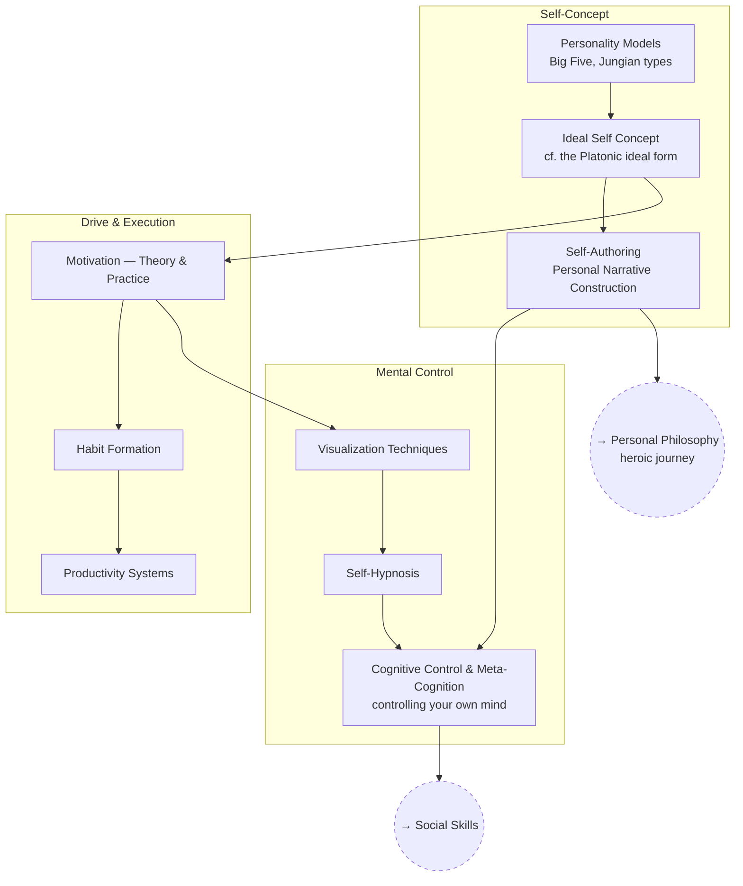

# Psychology & Self-Mastery

Controlling your own mind: personality, motivation, habits, and building
toward an ideal-self concept on purpose instead of by accident.

## Skill Tree

## Nodes

| ID | Concept | Depends on | Status | Resources / Notes |
|---|---|---|---|---|
| PSY_PERSONALITY | Personality Models (Big Five, Jungian types) | — | [ ] | |
| PSY_IDEAL | Ideal Self Concept | PSY_PERSONALITY | [ ] | |
| PSY_AUTHOR | Self-Authoring / Personal Narrative Construction | PSY_IDEAL | [ ] | Jordan Peterson's Self-Authoring Suite |
| PSY_MOTIVE | Motivation — Theory & Practice | PSY_IDEAL | [ ] | |
| PSY_HABIT | Habit Formation | PSY_MOTIVE | [ ] | James Clear, *Atomic Habits* |
| PSY_PRODUCTIVITY | Productivity Systems | PSY_HABIT | [ ] | |
| PSY_VISUAL | Visualization Techniques | PSY_MOTIVE | [ ] | |
| PSY_HYPNO | Self-Hypnosis | PSY_VISUAL | [ ] | |
| PSY_COGCTRL | Cognitive Control & Meta-Cognition | PSY_HYPNO, PSY_AUTHOR | [ ] | |

## Related Trees

- [Personal Philosophy](personal-philosophy.md) — `PSY_AUTHOR` is the
  practical arm of `PP_HERO`/`PP_PATRIARCH`.
- [Social Skills](social-skills.md) — `PSY_COGCTRL` (self-control) is a
  prerequisite for reliably good `SOC_COMM`.
