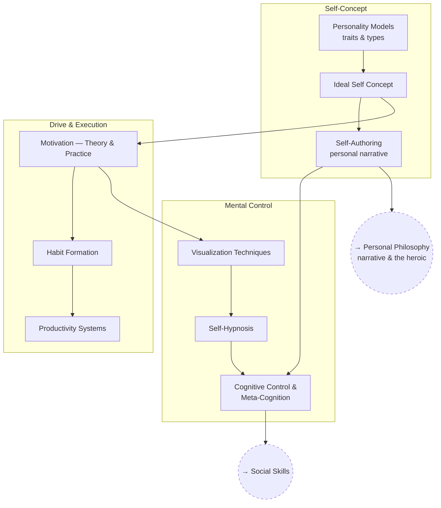

# Psychology & Self-Mastery

The mechanics of running yourself on purpose: what's stable about a person,
what moves them, and what can actually be changed by deciding to change it.

The structure runs from description (what a person is) to drive (what makes
them act) to control (what they can do about their own mind). Specific
techniques and enthusiasms are open questions *inside* these branches, and
where the evidence for a technique is thin, the article says so.

## Tree

## Articles

**Self-Concept**
- [Personality Models](articles/personality-models.md) — `PSY_PERSONALITY`
- [Ideal Self Concept](articles/ideal-self-concept.md) — `PSY_IDEAL`
- [Self-Authoring & Personal Narrative](articles/self-authoring.md) — `PSY_AUTHOR`

**Drive & Execution**
- [Motivation — Theory & Practice](articles/motivation.md) — `PSY_MOTIVE`
- [Habit Formation](articles/habit-formation.md) — `PSY_HABIT`
- [Productivity Systems](articles/productivity-systems.md) — `PSY_PRODUCTIVITY`

**Mental Control**
- [Visualization Techniques](articles/visualization.md) — `PSY_VISUAL`
- [Self-Hypnosis](articles/self-hypnosis.md) — `PSY_HYPNO`
- [Cognitive Control & Meta-Cognition](articles/cognitive-control-and-metacognition.md) — `PSY_COGCTRL`

## Related Trees

- [Personal Philosophy](../personal-philosophy/index.md) — self-authoring is
  the practical arm of the narrative and heroic work.
- [Social Skills](../social-skills/index.md) — cognitive control is a
  prerequisite for reliable communication under pressure.

See also: [Book List](../../BOOKLIST.md).
