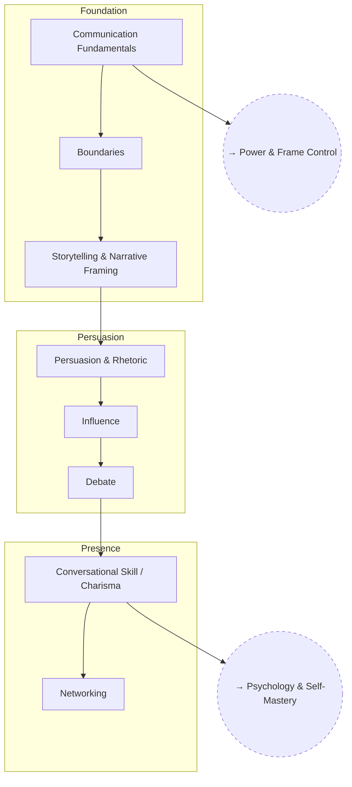

# Social Skills

Communication, persuasion, and reading a room — the practical layer on top
of frame control and psychology.

## Skill Tree

## Nodes

| ID | Concept | Depends on | Status | Resources / Notes |
|---|---|---|---|---|
| SOC_COMM | Communication Fundamentals | — | [ ] | |
| SOC_BOUND | Boundaries | SOC_COMM | [ ] | |
| SOC_STORY | Storytelling & Narrative Framing | SOC_BOUND | [ ] | |
| SOC_PERSUADE | Persuasion & Rhetoric | SOC_STORY | [ ] | Includes irony and other rhetorical devices |
| SOC_INFLUENCE | Influence | SOC_PERSUADE | [ ] | |
| SOC_DEBATE | Debate | SOC_INFLUENCE | [ ] | |
| SOC_CONVO | Conversational Skill / Charisma | SOC_DEBATE | [ ] | |
| SOC_NETWORK | Networking | SOC_CONVO | [ ] | |

## Related Trees

- [Power & Frame Control](power-and-frame-control.md) — `PWR_FRAME` underlies
  everything in this tree.
- [Psychology & Self-Mastery](psychology-self-mastery.md) — `PSY_COGCTRL`
  (self-control) is what makes `SOC_CONVO` reliable under pressure.
