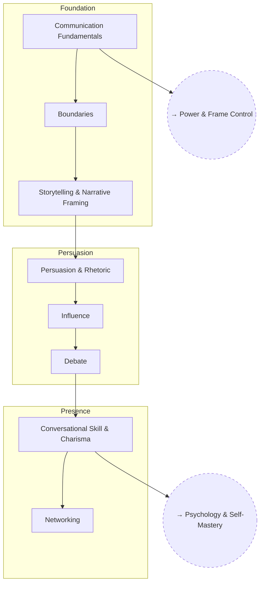

# Social Skills

Communication, persuasion, and reading a room — the practical layer sitting
on top of frame control and psychology.

## Tree

## Related Trees

- [Power & Frame Control](../power-and-frame-control/index.md) — frame
  control underlies everything in this tree.
- [Psychology & Self-Mastery](../psychology-self-mastery/index.md) —
  cognitive control is what makes conversational skill reliable under
  pressure.

- [Social Identity](../../personal/social-identity.md) — the theory of
  social identity, and defining mine.

See also: [Book List](../../BOOKLIST.md).
