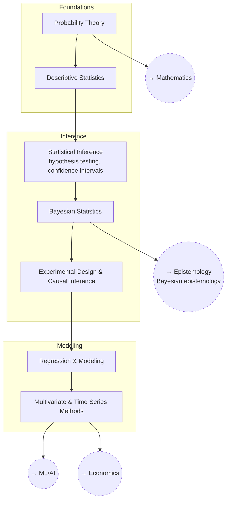

# Statistics

Probability, inference, and how to actually trust (or distrust) a
conclusion drawn from data.

## Skill Tree

## Nodes

| ID | Concept | Depends on | Status | Resources / Notes |
|---|---|---|---|---|
| STAT_PROB | Probability Theory | — | [ ] | |
| STAT_DESC | Descriptive Statistics | STAT_PROB | [ ] | |
| STAT_INFER | Statistical Inference | STAT_DESC | [ ] | |
| STAT_BAYES | Bayesian Statistics | STAT_INFER | [ ] | |
| STAT_EXPDESIGN | Experimental Design & Causal Inference | STAT_BAYES | [ ] | |
| STAT_REGRESS | Regression & Modeling | STAT_EXPDESIGN | [ ] | |
| STAT_MULTI | Multivariate & Time Series Methods | STAT_REGRESS | [ ] | |

## Related Trees

- [Mathematics](math.md) — `STAT_PROB` builds on `MATH_LINALG` and
  `MATH_REALANAL`.
- [Epistemology](epistemology.md) — `STAT_BAYES` is `EP_BAYES` in practice.
- [Machine Learning / AI](machine-learning-ai.md) — `STAT_MULTI` feeds
  `ML_MATH` and `ML_EVAL`.
- [Economics](economics.md) — `STAT_MULTI` underlies `ECON_MACRO` modeling.
- [Biology](biology.md) — `STAT_EXPDESIGN` underlies `BIO_EVO` (population
  genetics) and experimental biology generally.
